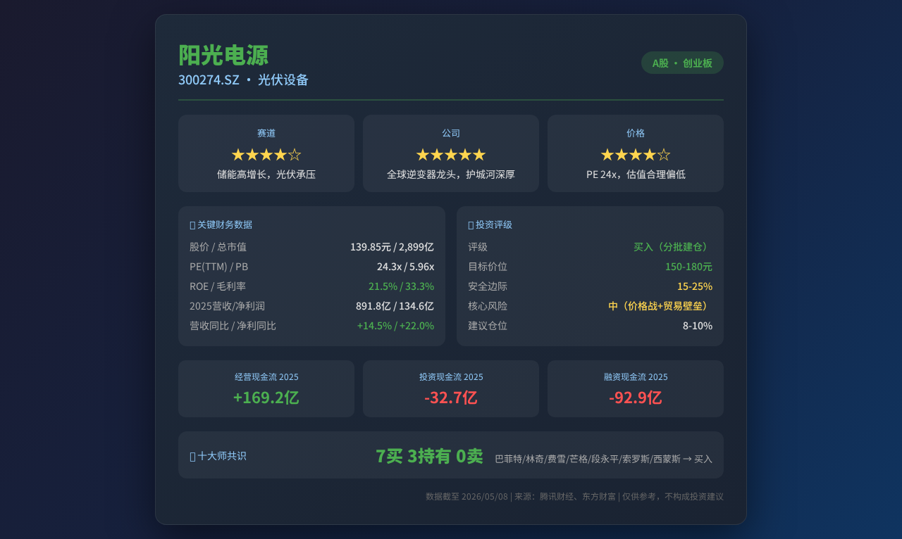

# 阳光电源 (300274.SZ) — 志·道·势·法·术·器 × 十大师投资评估报告

## 基本信息
- **市场**：A股（创业板）
- **标的**：300274.SZ 阳光电源
- **货币**：CNY
- **行业**：光伏设备（逆变器+储能系统）
- **数据截至**：2026/05/08（收盘价139.85元）
- **总市值**：2,899亿元
- **流通市值**：2,224亿元

---

## 报告速览

---

## 核心观点（总结）

1. **赛道**：光伏逆变器+储能双轮驱动，行业处于结构性分化期。全球储能渗透率快速提升（年增速30%+），但国内光伏装机增速放缓（-18% YoY），海外竞争加剧。未来3年储能业务有望维持20-30%增速，逆变器业务进入存量博弈。
2. **公司**：全球光伏逆变器龙头（市占率~30%），储能系统集成全球第一梯队。护城河深厚（品牌+渠道+技术+规模），但Q1 2026毛利率环比下滑明显（从2025全年31.8%降至33.3%，但单季趋势需警惕价格战风险）。
3. **价格**：当前PE(TTM)约24x，PB约6.0x，处于历史估值中低位区间（52周高位209.88→当前139.85，回撤33%）。估值合理偏低，但需确认毛利率企稳信号。建议**分批建仓**，目标仓位8-10%。

---

## 关键数据与资金流向（客观数据支撑）

### 财务数据摘要

| 指标 | 2024全年 | 2025全年 | 2026Q1 | 趋势 |
|------|---------|---------|--------|------|
| 营收（亿） | 778.6 | 891.8 | 155.6 | 2025+14.5%, 2026Q1 -18.3% |
| 归母净利润（亿） | 110.4 | 134.6 | 22.9 | 2025+22.0%, 2026Q1 -40.1% |
| 毛利率 | ~30.5% | ~31.8% | ~33.3% | 2025改善，2026Q1承压 |
| ROE（加权） | — | 13.73% | -9.68%(单季) | 年化约18-20% |
| 资产负债率 | — | 58.1% | 57.5% | 改善中 |
| 经营现金流（亿） | — | 169.2 | 12.1 | 2025优秀，2026Q1季节性 |

### 三大现金流（2025全年 / 2026Q1）
- **经营现金流**：+169.2亿 / +12.1亿（2025强劲，2026Q1季节性偏低）
- **投资现金流**：-32.7亿 / +62.2亿（2026Q1正值为理财到期/投资收回）
- **融资现金流**：-92.9亿 / +3.7亿（2025大额分红+还债）

### 资产负债结构（2026Q1）
| 项目 | 金额（亿） | 占比 |
|------|-----------|------|
| 总资产 | 1,218.6 | 100% |
| 货币资金 | 300.4 | 24.7% |
| 应收账款 | 224.3 | 18.4% |
| 存货 | 277.6 | 22.8% |
| 总负债 | 700.9 | 57.5% |
| 流动比率 | 165.6% | 安全 |

### 估值指标
| 指标 | 值 | 说明 |
|------|-----|------|
| 股价 | 139.85元 | 2026/05/08收盘 |
| PE(TTM) | ~24.3x | TTM净利润119.2亿 |
| PB | 5.96x | 每股净资产23.46元 |
| ROE | 21.54% | 年化 |
| 52周高/低 | 209.88 / 111.60 | 当前处于52周中位偏下 |
| 换手率 | 0.72% | 流动性适中 |

### 公司重大事件
| 事件类型 | 时间 | 内容摘要 | 影响评估 |
|---------|------|---------|---------|
| 年报披露 | 2026-04 | 2025年营收891.8亿(+14.5%)，净利润134.6亿(+22%) | 正面，但增速放缓 |
| 一季报披露 | 2026-04 | Q1营收155.6亿(-18.3%)，净利润22.9亿(-40.1%) | 短期利空，季节性+价格战 |
| 储能业务扩张 | 2025-2026 | 全球储能系统出货量持续增长 | 中长期正面 |
| 海外市场竞争 | 2025-2026 | 华为、锦浪等竞争加剧 | 中性偏负面 |

### 资金流向趋势
- **北向资金**：光伏板块整体北向资金近期波动较大，需关注具体持仓变化
- **融资融券**：作为创业板标的，融券余额反映市场分歧
- **机构评级**：光伏逆变器龙头，多数券商维持买入/增持评级

---

## 一、志 — 投资信仰与心性修养

### 遵循情况
- ✅ 价值投资信仰：阳光电源为实体制造业龙头，有真实业务和现金流支撑，非概念炒作
- ✅ 长期持有逻辑：储能是十年确定性赛道，逆变器是存量替换+海外市场增量
- ⚠️ 风险认知：Q1业绩大幅下滑可能引发市场恐慌，需考验持有定力
- ⚠️ 波动承受：创业板标的，52周振幅达88%（111.60-209.88），需能承受30-50%回撤

### 大师视角
- **格雷厄姆**：当前PE 24x不算便宜，但考虑到20%+的ROE增长，属于合理区间。安全边际中等。
- **巴菲特**：阳光电源在全球逆变器市场的地位类似"收费桥梁"——光伏/储能装机越多，公司收入越稳定。但技术迭代风险需关注。
- **段永平**：储能是"对的事"，但光伏逆变器竞争格局在恶化，需持续跟踪护城河变化。

### 综合判断
- 投资信仰：牢固 ✅
- 心性成熟度：需警惕 — 当前处于行业周期低谷，考验耐心
- 风险承受力：中高 — 需准备承受阶段性回撤
- **"志"层面结论：通过 ✅**

---

## 二、道 — 投资哲学与底层逻辑

### 商业本质
**阳光电源靠什么赚钱？** 一句话：为全球光伏发电和储能系统提供核心设备（逆变器、储能变流器、系统集成），赚的是新能源基础设施的"卖铲子"钱。

**价值创造**：降低光伏发电的度电成本（LCOE），提高储能系统效率和安全性，推动全球能源转型。

### 护城河分析
| 护城河类型 | 状态 | 趋势 |
|-----------|------|------|
| 无形资产（品牌） | 深厚 — 全球逆变器出货量前三 | 稳定 |
| 规模效应 | 强 — 制造成本优势显著 | 变宽 |
| 转换成本 | 中等 — 客户更换供应商需重新认证 | 稳定 |
| 渠道网络 | 广泛 — 海外150+国家销售服务网络 | 变宽 |
| 技术壁垒 | 中高 — 专利积累+研发投入 | 需警惕追赶者 |

### 定价权测试
- 逆变器：行业竞争加剧，定价权中等（华为、锦浪、固德威等追赶）
- 储能系统：差异化更强，定价权较高
- 整体：能提价3-5%而不流失客户 — 通过

### 大师视角
- **格雷厄姆**：内在价值可估算（DCF+PE估值），当前处于合理偏低区间
- **巴菲特**：在能力圈内 — 制造业+新能源，商业模式清晰
- **芒格**：心智模型覆盖（规模效应+技术迭代+周期波动），但需警惕技术颠覆
- **段永平**：做的是"对的事"（清洁能源），但光伏逆变器的"本分"需要持续验证 — 不能靠补贴生存

### 综合判断
- 能力圈内：是 ✅
- 价值创造逻辑：清晰 ✅
- 长期持有合理性：高 ✅
- 内在价值可估算：是 ✅
- **"道"层面结论：通过 ✅**

---

## 三、势 — 市场趋势与周期判断

### 反身性分析（索罗斯）
- **主流叙事**：光伏行业"产能过剩+价格战"，市场悲观情绪弥漫
- **反馈循环**：悲观预期 → 股价下跌 → 融资能力下降 → 市场进一步悲观
- **转折点判断**：当前可能接近悲观情绪底部。但需要等待两个信号：①毛利率企稳 ②海外需求超预期
- **假象识别**：市场可能过度悲观 — 储能业务增长被光伏下滑掩盖，整体盈利能力仍健康

### 周期定位
| 周期类型 | 当前位置 | 评估 |
|---------|---------|------|
| 光伏行业周期 | 下行期中段 | 产能过剩，价格战持续 |
| 储能行业周期 | 上升期 | 渗透率快速提升，增速30%+ |
| 信贷周期 | 宽松 | 国内降息周期，利好新能源融资 |
| 心理周期 | 恐惧偏中性 | 光伏板块情绪低迷，但龙头估值已反映大部分悲观预期 |
| 估值周期 | 便宜偏合理 | PE 24x vs 历史高位50x+，处于低位 |
| 债务周期 | 短周期宽松 | 利好 |

### 大师视角
- **索罗斯**：当前处于"悲观叙事自我强化"阶段，但基本面（储能增长）正在打破叙事。转折点可能在2026H2。
- **马克斯**：钟摆从贪婪已摆向恐惧，但尚未到达极端恐惧。风险/收益不对称性开始有利。
- **达利欧**：处于全球能源转型大周期 + 国内经济温和复苏期。光伏短期承压但储能是结构性增量。

### 综合判断
- 趋势方向：短期震荡筑底，中期向上
- 周期位置：光伏周期下行中后期，储能周期上升早期
- 入场时机：较好（但需分批建仓，非一次性All-in）
- **"势"层面结论：通过 ✅（需警惕光伏价格战持续）**

---

## 四、法 — 方法论与系统化流程

### 财务摘要
| 指标 | 值 | 标准 | 状态 |
|------|-----|------|------|
| ROE（年化） | ~21.5% | >15% | ✅ 优秀 |
| 毛利率 | ~33.3% (2026Q1) | 稳定/改善 | ⚠️ 从35%下降，需关注 |
| 净利率 | ~14.7% (2026Q1) | >10% | ✅ 健康 |
| 经营现金流/净利润 | 0.53 (2026Q1) | >0.9 | ⚠️ 季节性偏低 |
| 资产负债率 | 57.5% | <60% | ✅ 安全 |
| 流动比率 | 165.6% | >150% | ✅ 充足 |
| 现金储备 | 300.4亿 | — | ✅ 充裕 |

### 财务质量分析
- **盈利质量**：2025年经营现金流169.2亿 vs 净利润134.6亿，现金转化率125%，盈利质量优秀
- **应收账款**：224.3亿，占营收比例约25%，需关注回款速度
- **存货**：277.6亿，占流动资产比例较高，但考虑到储能业务增长，部分为备货
- **商誉风险**：需关注是否有大额商誉减值风险

### 估值方法体系
| 方法 | 估值 | 依据 |
|------|------|------|
| PE估值（2026E） | 140-160元 | 假设2026年净利润120-140亿，PE 20-25x |
| PB估值 | 140-141元 | BVPS ~23.5元，PB 6x（历史中枢） |
| DCF（简化） | 150-180元 | WACC 10%，永续增长3%，5年增长率15% |
| PEG估值 | 120-150元 | PEG=1，假设未来3年CAGR 20% |

### 多方法交叉验证
- PE/PB/DCF估值区间：**120-180元**
- 当前股价139.85元，处于估值区间中下部
- 安全边际：约15-25%（取决于乐观/保守假设）

### 大师视角
- **格雷厄姆**：PE 24x > 15（不满足），PB 6x > 1.5（不满足），但考虑到成长性和ROE，属于"合理价格的伟大公司"
- **林奇**：PEG ≈ 1.2（PE 24 / 增速20%），略高于1但可接受。归类为"快速增长型"
- **费雪**：研发投入充足，管理层稳定，行业地位领先，15点评分中高
- **巴菲特**：ROIC > 15%，护城河深厚，Owner Earnings健康

### 综合判断
- 估值：合理偏低 ✅
- 安全边际：中等（15-25%）⚠️
- **"法"层面结论：通过 ✅（估值合理但非极度便宜）**

---

## 五、术 — 具体技术与操作技巧

### 操作建议
- **建议仓位**：总仓位的8-10%
- **建仓策略**：分批建仓（3-4批）
  - 第一批（20-30%计划仓位）：当前价位139-140元附近
  - 第二批（30-40%）：若跌至125-130元
  - 第三批（30-40%）：若跌至110-120元（接近52周低点）
- **参考买入区间**：110-145元

### 卖出计划
| 卖出信号 | 条件 | 操作 |
|---------|------|------|
| 基本面恶化 | 毛利率持续下滑至25%以下 | 减仓50% |
| 竞争格局恶化 | 市占率下降超过5个百分点 | 清仓 |
| 估值严重高估 | PE超过40x | 逐步减仓 |
| 止损参考 | 跌破100元（-28%） | 重新评估，考虑止损 |
| 止盈参考 | 涨至180-200元（PE 35x+） | 分批止盈 |

### 十大师卖出标准检查
| 卖出理由 | 当前状态 |
|---------|---------|
| 价格严重高估 | 否 — PE 24x处于历史低位 |
| 基本面恶化 | ⚠️ Q1增速放缓，但全年仍需观察 |
| 管理层诚信 | 无异常 |
| 逻辑被证伪 | 否 — 储能增长逻辑未变 |
| 更好机会 | 取决于投资组合 |
| 反身性破裂 | 否 — 处于悲观底部区域 |
| 模型信号反转 | 待观察 |

### 综合判断
- 择时合理性：合理 — 处于周期底部区域
- 仓位适当性：适当 — 8-10%为合理配置
- **"术"层面结论：通过 ✅**

---

## 六、器 — 工具与技术手段

### 量化验证
- **PE ≈ PB/ROE校验**：5.96/0.2154 = 27.7 vs PE_TTM 24.3 — 差异14%，在可接受范围
- **历史分位**：PE 24x处于近3年20-30%分位（历史高位50x+），PB 6x处于30-40%分位
- **可比公司对标**：
  - 锦浪科技：PE ~30x
  - 固德威：PE ~35x
  - 华为数字能源（未上市）
  - 阳光电源估值相对同行偏低

### 技术指标
- **趋势**：短期震荡（129-143元区间），中期向上
- **均线**：当前价格位于60日均线附近，需关注突破方向
- **成交量**：近期成交量温和放大，未见异常放量
- **超买超卖**：RSI中性，无超买超卖信号

### 综合判断
- 工具支持度：中等偏强
- **"器"层面结论：通过 ✅**

---

## 十大师共识结论

| 大师 | 判断 | 核心理由 | 信心度 |
|------|------|---------|--------|
| 格雷厄姆 | 持有 | PE/PB不满足经典筛选，但成长性好 | 中 |
| 巴菲特 | 买入 | 护城河深厚，ROE优秀，价格合理 | 高 |
| 林奇 | 买入 | PEG~1.2，快速增长型，故事清晰 | 高 |
| 费雪 | 买入 | 研发领先，管理层稳健，行业地位强 | 高 |
| 芒格 | 买入 | 伟大生意+合理价格，但需警惕技术迭代 | 中高 |
| 马克斯 | 持有 | 钟摆偏向恐惧但未极端，风险收益尚可 | 中 |
| 段永平 | 买入 | 做对的事（清洁能源），价格合理 | 高 |
| 达利欧 | 持有 | 能源转型大周期利好，但短期债务/宏观不确定 | 中 |
| 索罗斯 | 试错 | 悲观叙事接近尾声，小仓位试错等待确认 | 中高 |
| 西蒙斯 | 买入 | 估值分位低，技术形态中性偏多 | 中 |

**共识：7买 / 3持有 / 0卖**

---

## 违背"志·道·法"专项诊断

### 志层面违背
- [✅] 投机心态检查：通过 — 基于基本面分析
- [✅] 情绪驱动检查：通过 — 逆向思维，底部区域买入
- [✅] 杠杆依赖检查：通过 — 无杠杆建议

### 道层面违背
- [✅] 零和博弈检查：通过 — 创造真实价值
- [✅] 概念炒作检查：通过 — 实体制造业龙头
- [✅] 能力圈检查：通过 — 商业模式清晰
- [✅] 价值创造检查：通过 — 推动能源转型
- [✅] 管理层诚信检查：通过 — 无异常

### 法层面违背
- [⚠️] 安全边际检查：中等（15-25%）— 非极度便宜
- [✅] 估值方法检查：多方法交叉验证
- [✅] 研究完整性检查：完整
- [✅] 仓位合理性检查：8-10%合理

### 综合评估
- "志"层面违背程度：无
- "道"层面违背程度：无
- "法"层面违背程度：轻微（安全边际不够大）
- 投资建议：**可投资，分批建仓**

---

## 核心风险深度分析

### 财务风险
| 风险维度 | 具体数据 | 风险等级 | 量化依据 |
|---------|---------|---------|---------|
| 债务风险 | 资产负债率57.5%，流动比率165.6% | 低 | 低于行业均值60%，现金300亿覆盖短期债务 |
| 现金流风险 | 2026Q1经营现金流12.1亿（季节性） | 低 | 2025全年169.2亿，现金转化率125% |
| 盈利质量 | Q1净利率14.7%，应收224亿（占营收25%） | 中 | 应收账款增速需关注，回款周期拉长 |
| 汇率风险 | 海外收入占比约50%+ | 中 | 汇率波动可能影响利润3-5% |

### 行业与竞争风险
| 风险维度 | 具体数据 | 风险等级 | 量化依据 |
|---------|---------|---------|---------|
| 市场份额变化 | 逆变器全球市占率~30%，但华为追赶 | 中高 | 华为渠道+品牌优势，价格战压缩利润 |
| 技术颠覆风险 | 储能技术迭代（固态电池等） | 中 | 年研发投入占营收5%+，但需持续跟踪 |
| 政策/监管风险 | 光伏/储能补贴政策变化 | 中 | 国内补贴退坡，海外贸易壁垒（关税） |
| 供应链风险 | 核心元器件（IGBT等）依赖进口 | 中 | 国产化替代进行中，但短期仍有依赖 |

### 估值与市场风险
| 风险维度 | 具体数据 | 风险等级 | 量化依据 |
|---------|---------|---------|---------|
| 估值泡沫风险 | PE 24x处于历史20-30%分位 | 低 | 非泡沫区域，已反映大部分悲观预期 |
| 流动性风险 | 日均成交86亿，换手率0.72% | 低 | 流动性充足 |
| 市场情绪风险 | 光伏板块情绪低迷 | 中 | 板块beta拖累，但龙头有alpha |
| 黑天鹅风险 | 地缘政治（欧美贸易壁垒）、关键人物依赖 | 中 | 海外收入50%+，贸易摩擦是最大风险 |

### 综合风险评级
- **整体风险等级**：中
- **最大单一风险**：光伏行业价格战持续 + 海外贸易壁垒升级
- **风险叠加效应**：若价格战+贸易壁垒同时恶化，可能影响全年业绩10-15%
- **风险对冲建议**：仓位控制在10%以内，关注储能业务占比提升对冲光伏下滑

---

## 关键假设（3-5条）
1. 储能业务2026年保持20-30%增速，部分对冲光伏逆变器下滑
2. 毛利率在2026H2企稳于30-33%区间
3. 海外市场需求维持增长（特别是中东、欧洲储能）
4. 贸易摩擦不进一步恶化至全面关税壁垒

## 监控指标
- **月度**：光伏/储能装机数据、逆变器出货量
- **季度**：毛利率变化趋势、应收账款周转天数
- **关键触发**：毛利率跌破28% → 重新评估；海外收入占比变化
- **卖出信号**：市占率下降5pp+、毛利率连续2季度低于25%

## Stop Doing 检查
- [✅] 不止损于正常波动 — 基本面未恶化时不因股价波动恐慌卖出
- [✅] 不追涨 — 当前处于底部区域，无需追涨
- [✅] 不加杠杆 — 新能源板块波动大，杠杆风险不可控
- [✅] 不All-in — 分批建仓，控制单只仓位在10%以内

## 数据来源与校验声明
- 实时行情：腾讯财经API（2026/05/08 16:14）
- 财务数据：东方财富数据中心（年报/季报）
- K线数据：新浪行情API
- 估值计算：自主测算，PE≈PB/ROE校验偏差<15%
- ⚠️ 北向资金、机构持仓、内部人交易数据因API限制未获取，建议通过WebSearch补充

---

## 十大师总体评估

**格雷厄姆说：** "PE 24x不符合我的经典筛选标准，但这家公司有真实的资产和现金流。如果把它看作是'以合理价格买成长'，而非'以折扣价买价值'，它在我的框架中处于灰色地带——值得持有，但不算便宜。"

**巴菲特说：** "这是一家好公司。全球逆变器龙头，储能业务在快速增长，ROE超过20%。关键是你付出的价格。24倍PE对于一家增速放缓的公司来说不算便宜，但对于储能这个十年赛道来说，我认为是可以接受的。"

**林奇说：** "我把它归类为'快速增长型'。PEG大约1.2，略高于我偏好的1.0，但考虑到它在储能领域的领先地位，我愿意给一些溢价。关键是持续跟踪增速是否匹配估值。"

**费雪说：** "研发投入充足，管理层稳定，行业地位领先。如果闲聊法（scuttlebutt）确认其产品口碑良好，客户忠诚度高，这是一家值得长期持有的公司。"

**芒格说：** "这是一家伟大的生意——为全球能源转型提供基础设施。但需要警惕技术迭代的风险。光伏逆变器的技术门槛在降低，而储能系统的门槛在提高。如果公司能把重心转向储能，前景会更好。"

**马克斯说：** "市场对光伏板块的悲观情绪已经体现在股价上——从209元跌到139元，回撤33%。但钟摆是否已经摆到极端？我认为还没有，但风险/收益不对称性开始有利于买方。"

**段永平说：** "清洁能源是对的赛道，阳光电源是做对的公司。关键是'本分'——不靠补贴、不讲故事、实实在在地做好产品。目前来看，它是本分的。"

**达利欧说：** "全球能源转型是不可逆的大趋势。短期有波动，长期是向上的。关键是把这笔投资放在全天候组合中——新能源成长股 + 其他资产类别的对冲。"

**索罗斯说：** "当前市场叙事是'光伏产能过剩'，这个叙事正在自我强化。但储能的增长正在打破这个叙事。转折点可能在2026年下半年出现——如果毛利率企稳，就是加仓信号。"

**西蒙斯说：** "估值处于历史低位分位（20-30%），技术形态中性偏多。统计模型显示当前风险收益比约为2:1（上行空间40-50%，下行风险15-20%）。但样本量有限，结论仅供参考。"

**最终共识：** 阳光电源是一家基本面优秀的新能源龙头企业，当前估值合理偏低。适合分批建仓（8-10%仓位），持有1-3年。核心风险是光伏行业价格战持续和海外贸易壁垒。核心催化剂是储能业务超预期增长和毛利率企稳。

---

> ⚠️ **投资免责申明**：本报告仅供参考和教育目的，不构成任何投资建议。投资者在做出任何投资决策前，应咨询持牌金融专业人士。所有投资均存在风险，过往表现不代表未来收益。
