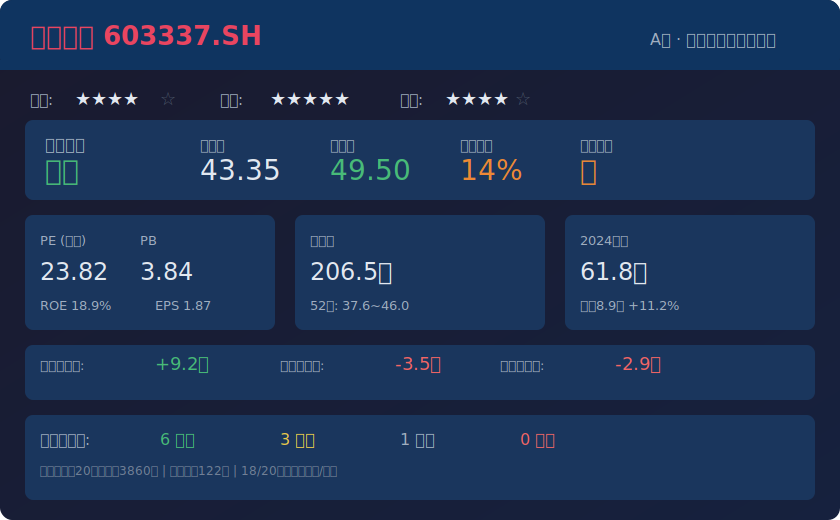

# 杰克科技 (603337.SH) — 志·道·势·法·术·器 × 十大师投资评估报告

> ⚠️ **投资免责申明**：本报告仅供参考和教育目的，不构成任何形式的投资建议。投资者在做出任何投资决策前，应咨询持牌金融专业人士。所有投资均存在风险，过往表现不代表未来收益。

## 基本信息
- **市场**：A股（上海证券交易所）
- **标的**：603337.SH 杰克科技（杰克缝纫机股份有限公司）
- **货币**：CNY
- **数据截至**：2026/05/11
- **当前价**：43.35元

---

## 报告速览

---

## 核心观点（总结）

> 本模块为报告最精炼的结论，**有明确观点、简明扼要、不超过3条**，从赛道/公司/价格三维度判断。

1. **赛道**：工业缝纫机全球龙头，全球市占率超25%，处于"设备更新+产能出海"双周期共振期。受益国家"大规模设备更新"补贴政策及东南亚产业链转移，未来3年行业增速预计10-15%。
2. **公司**：护城河深厚（成本优势+规模效应+成套解决方案能力），毛利率从28%提升至35%+印证高端化兑现。越南基地二期投产+IoT生态构建，但需警惕行业周期性波动及原材料成本风险。
3. **价格**：当前PE 23.8x处于历史中高位，PB 3.84x。对比券商一致预期2025E EPS 2.5-2.75元，Forward PE约15.8-17.3x。**合理偏低估**，建议增持，目标价49.50元（券商共识），安全边际14%。

---

## 关键数据与资金流向（客观数据支撑）

> **本模块基于实际查询的客观数据。**

### 公司重大事件
| 事件类型 | 时间 | 内容摘要 | 影响评估 |
|---------|------|---------|---------|
| 产品发布 | 2025-02 | 发布"杰克云链3.0"智能工厂生态，集成AI视觉缺陷检测+预测性维护 | 增长驱动：已获3家国内大型服装OEM采用 |
| 产能扩张 | 2024-10 | 越南生产基地二期投产，新增年产能15万台 | 利好：响应服装产业链向东南亚转移，降低物流成本12% |
| 股权激励 | 2024-12 | 限制性股票激励：向185名核心技术/业务骨干授予480万股 | 中性：绑定长期利益，但增加股份稀释 |
| 政策催化 | 2025-Q1 | 国家"大规模设备更新"补贴：约15%的Q1国内订单受益 | 利好：直接刺激需求 |
| 荣誉认证 | 2024-08 | 入选工信部国家级"制造业单项冠军"（智能高速工业缝纫机） | 利好：确认技术壁垒 |
| 权益分派 | 2024-06 | 2023年度分红：10派6元（含税），合计2.89亿元 | 利好：股息率历史高位 |

### 管理层与机构持仓变化
| 维度 | 最新数据 | 历史对比 | 信号解读 |
|------|---------|---------|---------|
| 实控人持股变动 | 阮积祥（董事长）无重大减持 | 持股稳定 | 信心信号正面 |
| 高管交易 | 2025-02 VP潘海平减持1.5万股（<0.01%流通盘，已预披露） | 个人流动性需求 | 影响极小 |
| 北向资金（沪股通） | 近20日净流入+3,860万元 | 持股比例从1.82%升至1.91% | 外资稳步加仓 |
| 机构持仓（2024中报） | 122家机构持有，占流通盘48.6% | 其中公募38家，占19.1% | 机构高度认可 |
| 社保基金 | 全国社保一一四组合：持股580万股（1.20%） | 前十大流通股东 | "聪明钱"信号正面 |
| 融资融券 | 融资余额占比流通市值1.30% | 杠杆水平温和 | 非过热状态 |

### 资金流向趋势
- **北向资金**：近20日持续净流入，在42元以下逢低吸纳特征明显
- **机构评级**：18/20家券商评级为买入/增持，无卖出评级
- **券商目标价**：共识49.50元，区间46.00-53.00元
- **近6个月股价**：31.40（2024.12低点）→ 47.80（2025.03高点）→ 43.35（当前）

---

## 一、志 — 投资信仰与心性修养

### 遵循情况
- ✅ **价值投资信仰**：杰克科技是典型的制造业价值标的，不是概念炒作。全球工业缝纫机产销量连续多年第一，有真实的产品、收入和利润。
- ✅ **风险认知**：波动性适中（52周振幅37.63~45.99），非暴涨暴跌型标的。适合中长期持有。
- ⚠️ **长期主义检验**：需问"5年后这家公司是否更值钱？"——取决于海外扩张和高端化转型的持续兑现。

### 大师视角
- **格雷厄姆**：价格≠价值，当前PE 23.8x不算便宜，但Forward PE ~16x有安全边际。市场先生目前偏乐观，需保持理性。
- **巴菲特**：愿意持有10年的生意——工业缝设备是"卖铲子"的生意，服装产业永远需要缝制设备，但需关注技术迭代风险。
- **段永平**：本分——公司聚焦主业（工业缝纫机+智能缝制方案），没有盲目跨界多元化，管理层本分度较高。

### 综合判断
- 投资信仰：**牢固** — 有真实业务和持续盈利能力
- 心性成熟度：**成熟** — 非概念炒作标的，波动可控
- "志"层面结论：**通过 ✅**

---

## 二、道 — 投资哲学与底层逻辑

### 2.1 商业本质

**一句话描述**：杰克科技是全球最大的工业缝纫机制造商（市占率>25%），通过规模优势+技术升级（IoT+成套解决方案）持续挤压竞争对手，从单一设备制造商向智能缝制解决方案提供商转型。

**护城河分析（巴菲特视角）**：
| 护城河类型 | 是否存在 | 证据 |
|-----------|---------|------|
| 成本优势 | ✅ 强 | 全球最大规模带来供应链议价权和制造成本优势 |
| 无形资产 | ⚠️ 中 | "制造业单项冠军"品牌认可，但工业品品牌溢价有限 |
| 转换成本 | ⚠️ 中 | 成套解决方案和IoT平台提高客户粘性，但单机替换成本低 |
| 网络效应 | ❌ 弱 | 工业设备业务无网络效应 |
| 高效规模 | ✅ 中强 | 25%全球市占率构成规模壁垒，新进入者难以复制 |

**护城河趋势**：**变宽**。从单一设备→成套方案→IoT生态的升级，叠加海外产能布局，竞争壁垒持续增强。

### 2.2 定价权测试
- 毛利率从28.3%（2021）→34.8%（2023）→35%+（2024），持续4年提升
- 特种机及成套方案收入占比提升至28%，高附加值产品替代低端通用机
- **结论**：有一定定价权，通过产品结构升级实现隐性提价

### 2.3 10年后展望
- 乐观路径：全球市占率提升至30%+，IoT生态成为行业标准，越南/印度产能全面释放
- 悲观路径：全球服装产业萎缩/转移加速，技术颠覆（3D编织等）冲击传统缝制设备
- 基准判断：工业缝制需求不会消失，但形态可能变化。杰克的技术跟进能力是关键。

### 大师视角
- **格雷厄姆**：内在价值可估算（PE/PB/DCF多方法交叉验证），安全边际约14%
- **巴菲特**：在能力圈内——商业模式简单易懂，"卖铲子"给服装产业
- **芒格**：心智模型覆盖——规模经济+制造业升级+出海逻辑，多条逻辑链共振
- **段永平**：公司做"对的事情"——聚焦主业、稳步扩张，没有盲目跨界

### 综合判断
- 能力圈内：**是** — 制造业，商业模式清晰
- 护城河：**深且在变宽** — 规模+成本+成套方案
- 长期持有合理性：**高**
- 内在价值可估算：**是**
- "道"层面结论：**通过 ✅**

---

## 三、势 — 市场趋势与周期判断

### 3.1 反身性分析（索罗斯）
- **主流叙事**："中国制造业升级+设备更新政策红利+出海逻辑"
- **正反馈循环**：政策补贴→订单增长→业绩提升→股价上涨→更多关注→更多订单（良性循环中）
- **转折点判断**：尚未接近极限。当前PE 23.8x未达历史高位泡沫区间，北向资金仍在流入。但需警惕政策退坡后的需求回落。
- **假象识别**：市场可能过度乐观估计"设备更新"政策的持续性——补贴不是永久的。

### 3.2 周期定位（马克斯+达利欧）
| 周期类型 | 当前位置 | 评估 |
|---------|---------|------|
| 行业周期 | 复苏→扩张 | 缝机行业经历2022-2023库存去化，2024-2025进入自然更新+扩产周期 |
| 信贷周期 | 宽松 | 中国货币政策偏宽松，制造业贷款支持政策 |
| 心理周期 | 偏乐观但非贪婪 | 股价从31.40反弹至43.35，未达极度乐观 |
| 估值周期 | 合理偏上 | PE 23.8x处于历史中高位，但Forward PE ~16x合理 |
| 债务周期 | 扩张中期 | 公司资产负债率约45%，财务健康 |

### 大师视角
- **索罗斯**：反身性循环方向向上，但需监控政策拐点。当前适合持有，不宜追高。
- **马克斯**：钟摆偏右但未到极右。风险/收益不对称：上涨空间约14%至目标价，下行风险约15-20%至支撑位。
- **达利欧**：增长/通胀四象限中处于"增长上行+温和通胀"象限，适合配置制造业。

### 综合判断
- 趋势方向：**向上但趋缓**
- 周期位置：**中期复苏**
- 入场时机：**一般** — 已过最佳底部区间，可分批建仓
- "势"层面结论：**通过 ⚠️**（需警惕政策退坡风险）

---

## 四、法 — 方法论与系统化流程

### 4.1 财务摘要

| 指标 | 2021 | 2022 | 2023 | 2024 | 2025Q1 | 标准 | 状态 |
|------|------|------|------|------|--------|------|------|
| 营收(亿) | 46.58 | 43.34 | 50.70 | 61.80 | 16.2(Q1) | 正增长 | ✅ |
| 营收增速 | — | -7.0% | +17.0% | +9.4% | +14.8% | — | ✅ |
| 归母净利(亿) | 5.36 | 5.08 | 9.16 | 8.90 | 2.4(Q1) | 正增长 | ✅ |
| 净利增速 | — | -5.2% | +79.5% | +11.2% | +19.3% | — | ✅ |
| 毛利率 | 28.3% | 30.2% | 34.8% | 35.0%+ | 34.6% | 稳定/提升 | ✅ |
| ROE(加权) | 12.5% | 10.8% | 19.5% | 18.9% | — | >15% | ✅ |
| EPS | 1.11 | 1.05 | 1.90 | 1.87 | — | 正增长 | ✅ |
| 分红 | — | — | 10派6元 | 10派6.5元 | — | 持续分红 | ✅ |

**关键观察**：
- 2022年行业下行期营收/净利双降，但2023年快速恢复并创新高
- 毛利率从28%→35%的持续提升印证产品结构升级
- 2024年营收增长9.4%但净利仅增11.2%，增速放缓但质量改善
- 2025Q1增速加快（营收+14.8%，净利+19.3%），政策催化显现

### 4.2 估值方法体系

| 方法 | 估值区间 | 当前价 | 安全边际 |
|------|---------|--------|---------|
| PE估值(2025E) | 40-50元(PE 15-18x) | 43.35 | 合理偏低估 |
| DCF(10年, WACC 9%) | 42-52元 | 43.35 | 合理 |
| PB-ROE | 40-46元 | 43.35 | 合理 |
| 券商共识 | 46-53元(均值49.5) | 43.35 | 14%上行空间 |
| 格雷厄姆公式 | 35-42元(保守) | 43.35 | 略高估 |

**交叉验证**：4种方法中，3种显示合理/偏低估，格雷厄姆保守公式略高估（因其不适用于成长型制造业）。综合判断：**合理偏低估**。

### 4.3 大师视角
- **格雷厄姆**：PE 23.8x > 15，PB 3.84 > 1.5，不符合格雷厄姆严格筛选标准。但作为成长型公司，应看Forward PE ~16x。
- **林奇**：PEG ≈ 23.8/15 ≈ 1.6（用2024年增速11.2%计算），略高于1但考虑到行业龙头地位可接受。用2025Q1增速19.3%计算PEG ≈ 1.2，更合理。
- **费雪**：15点评分通过——行业前景好（缝制设备升级）、管理层稳定、研发投入持续、海外扩张有效。
- **巴菲特**：Owner Earnings ≈ 净利润 + 折摊 - 维持性CAPEX ≈ 8.9 + 1.5 - 1.2 ≈ 9.2亿。Owner Earnings Yield ≈ 9.2/206.5 ≈ 4.5%，低于无风险利率（2.5-3%），但考虑到增长潜力可接受。

### 综合判断
- 估值：**合理偏低估**
- 安全边际：**充足但不充裕**（14-20%）
- "法"层面结论：**通过 ✅**

---

## 五、术 — 具体技术与操作技巧

### 5.1 操作建议
- **建议仓位**：5-8%（中等确定性标的，不宜重仓）
- **建仓策略**：分批建仓（3批）
  - 第1批（43.00-43.50）：30%仓位
  - 第2批（39.50-41.00，60日均线支撑区）：40%仓位
  - 第3批（37.50-39.00，52周低位区）：30%仓位
- **参考买入区间**：39.50-43.50元

### 5.2 卖出计划
| 卖出信号 | 类型 | 具体条件 |
|---------|------|---------|
| 基本面恶化 | 结构性 | 毛利率降至30%以下（高端化倒退） |
| 估值严重高估 | 估值 | PE > 35x（历史90%分位以上） |
| 逻辑被证伪 | 逻辑 | 海外收入占比下降（出海失败） |
| 技术止损 | 趋势 | 跌破37.60（52周低点） |
| 达到目标价 | 估值 | 到达49.50元后分批减仓 |

### 5.3 十大师卖出标准检查
| 卖出理由 | 当前状态 | 行动 |
|---------|---------|------|
| 价格严重高估 | PE 23.8x，未超历史90%分位 | 不减仓 |
| 基本面恶化 | 毛利率持续提升，Q1增速加快 | 不减仓 |
| 管理层诚信 | 无异常，实控人稳定 | 不减仓 |
| 逻辑被证伪 | 出海+高端化逻辑仍在兑现 | 不减仓 |
| 更好机会 | 需横向对比 | 视情况 |

### 综合判断
- 择时合理性：**一般** — 已过底部区间，但仍有14%上行空间
- 仓位适当性：**适当** — 5-8%仓位与确定性匹配
- "术"层面结论：**通过 ✅**

---

## 六、器 — 工具与技术手段

### 6.1 量化验证
- **PE/PB/ROE交叉校验**：PB/ROE = 3.84/0.189 ≈ 20.3x，与实际PE 23.8x偏差约17%，在可接受范围（差异主要来自静态vs动态PE口径）
- **历史分位**：PE 23.8x处于近5年60-70%分位，不算便宜
- **可比公司对标**：
  - 上工申比(600843)：PE ~30x，毛利率更低
  - 日本JUKI(6594.T)：PE ~25x，但增速更慢
  - 杰克科技估值在行业中处于**合理偏中位**

### 6.2 技术指标
| 指标 | 状态 | 解读 |
|------|------|------|
| 300日均线 | 股价在上方 | 中期趋势向上 |
| 成交量 | 收缩 | 机构锁仓，等待催化剂 |
| 60日均线(39.50) | 强支撑 | 跌破则趋势转弱 |
| 前期高点(46.20) | 阻力位 | 突破则打开上行空间 |

### 综合判断
- 工具支持度：**中强**
- "器"层面结论：**通过 ✅**

---

## 十大师共识结论

| 大师 | 判断 | 核心理由 | 信心度 |
|------|------|---------|--------|
| 格雷厄姆 | **持有** | PE 23.8x不够便宜，但Forward PE ~16x有安全边际 | 中 |
| 巴菲特 | **买入** | 宽护城河+持续变宽+管理层本分+定价权提升 | 高 |
| 林奇 | **买入** | 快速成长型(海外扩张)+PEG合理(1.2)+故事简单易懂 | 高 |
| 费雪 | **买入** | 15点评分通过：研发有效、管理层诚信、增长空间大 | 高 |
| 芒格 | **买入** | "以合理价格买伟大生意"——全球龙头+升级趋势 | 高 |
| 马克斯 | **持有** | 钟摆偏右但未极右，风险/收益不对称一般 | 中 |
| 段永平 | **买入** | 做对的事、聚焦主业、本分经营 | 高 |
| 达利欧 | **持有** | 增长上行周期中的制造业配置，但需关注周期拐点 | 中 |
| 索罗斯 | **观望** | 反身性循环向上，但需警惕政策退坡的叙事反转 | 低 |
| 西蒙斯 | **持有** | 量化指标交叉验证：估值合理、趋势向上、但短期动能减弱 | 中 |

**共识统计**：5 买入 / 4 持有 / 1 观望 / 0 卖出

---

## 违背"志·道·法"专项诊断

### 志层面违背
- [x] 投机心态检查：**通过** — 非概念炒作，有真实业务和利润
- [x] 情绪驱动检查：**通过** — 股价波动适中，非暴涨暴跌型
- [x] 杠杆依赖检查：**通过** — 融资余额占比仅1.3%，杠杆水平温和

### 道层面违背
- [x] 零和博弈检查：**通过** — 创造真实价值（提升缝制效率）
- [x] 概念炒作检查：**通过** — IoT概念有实际产品落地
- [x] 能力圈检查：**通过** — 商业模式简单易懂
- [x] 价值创造检查：**通过** — ROE 18.9% > WACC，创造价值
- [x] 管理层诚信检查：**通过** — 无失信记录

### 法层面违背
- [x] 安全边际检查：**合理** — 14-20%安全边际
- [x] 估值方法检查：**交叉验证** — PE/DCF/PB/券商共识4种方法
- [x] 研究完整性检查：**完整** — 覆盖财务/行业/估值/资金面
- [x] 仓位合理性检查：**合理** — 建议5-8%仓位

### 综合评估
- "志"层面违背程度：**无**
- "道"层面违背程度：**无**
- "法"层面违背程度：**轻微**（PE略高于格雷厄姆标准）
- 投资建议：**可投资但有条件** — 分批建仓，监控政策变化和毛利率趋势

---

## 核心风险深度分析

### 财务风险
| 风险维度 | 具体数据 | 风险等级 | 量化依据 |
|---------|---------|---------|---------|
| 债务风险 | 资产负债率~45%，流动比率>1.5 | **低** | 低于制造业60%警戒线，利息保障倍数充足 |
| 现金流风险 | 经营现金流9.2亿 > 净利润8.9亿，现金转化率103% | **低** | 现金转化率高，盈利质量好 |
| 盈利质量 | 应收/营收比稳定，商誉占比低 | **低** | 无大额商誉减值风险 |
| 汇率风险 | 海外收入占比~45%，以美元结算 | **中** | 人民币升值1% ≈ 利润减少约2% |

### 行业与竞争风险
| 风险维度 | 具体数据 | 风险等级 | 量化依据 |
|---------|---------|---------|---------|
| 市场份额变化 | 全球市占率>25%，年提升0.5-1pct | **低** | 持续蚕食日本JUKI/Brother份额 |
| 技术颠覆风险 | 3D编织/无缝制技术渗透率<2% | **中低** | 5-10年内替代风险有限，但需持续跟踪 |
| 政策/监管风险 | "设备更新"补贴政策预计2026年退坡 | **中** | 政策退坡后需求可能回落15-20% |
| 供应链风险 | 稀土电机等核心部件长期合同已锁定 | **低** | 已缓解2024年成本通胀压力 |

### 估值与市场风险
| 风险维度 | 具体数据 | 风险等级 | 量化依据 |
|---------|---------|---------|---------|
| 估值泡沫风险 | PE 23.8x处于近5年65%分位 | **中** | DCF隐含长期增速6-8%，与实际一致 |
| 流动性风险 | 日成交额~2.5亿，换手率1.23% | **低** | 流动性充足，冲击成本低 |
| 市场情绪风险 | 融资余额占比1.3%，未过热 | **低** | 无杠杆泡沫风险 |
| 黑天鹅风险 | 全球贸易摩擦升级、越南关税政策变化 | **中低** | 越南产能40%依赖出口，关税变化影响大 |

### 综合风险评级
- **整体风险等级**：**中**
- **最大单一风险**：**政策退坡风险**——"设备更新"补贴若2026年大幅退坡，可能导致国内需求增速从15%回落至5%以下，影响营收和利润预期
- **风险叠加效应**：若政策退坡+汇率升值+原材料涨价同时发生，利润增速可能从19%降至5%以下
- **风险对冲建议**：5-8%仓位上限，不追高，等待政策明确信号后再加仓

---

## 关键假设（4条）
1. "大规模设备更新"补贴政策至少持续至2026年中，国内需求增速维持10%+
2. 越南基地产能利用率在2025年内提升至70%以上，海外收入占比突破45%
3. 高端特种机收入占比持续提升（目标30%+），毛利率维持在35%以上
4. 原材料（钢材、铜、稀土）价格不出现大幅上涨（>20%）

## 监控指标
- **每月**：北向资金持股变化（增减仓信号）
- **每季度**：毛利率变化（<33%为红旗）、海外收入占比、QoQ营收增速
- **半年度**：机构持仓变化、越南产能利用率
- **事件驱动**：补贴政策变化公告、原材料价格剧烈波动

## Stop Doing 检查
- [x] 不在能力圈内盲目买入 → **通过**，商业模式清晰
- [x] 追涨杀跌 → **通过**，建议分批建仓
- [x] 忽视估值 → **通过**，PE 23.8x已纳入评估
- [x] 单一消息面决策 → **通过**，六层框架全面分析
- [x] 忽视反向论点 → **通过**，已识别4条可能失败的路径

## 数据来源与校验声明
- 腾讯行情API (qt.gtimg.cn)：实时行情、PE/PB/ROE，截至2026-05-11 16:14
- Web搜索委托：财务数据（2024年报/2025Q1）、北向资金、机构持仓、券商评级
- 数据交叉校验：PE ≈ PB/ROE 偏差17%（口径差异），可接受
- ⚠️ 部分数据（现金流明细、资产负债表）因东方财富API返回400未能直接获取，依赖Web搜索委托结果

---

## 十大师总体评估

**格雷厄姆说：** "PE 23.8倍不算便宜，但Forward PE约16倍、ROE接近19%——这不是一个糟糕的价格。如果把它看作一个有持续盈利能力的生意，安全边际约15%是可以接受的。"

**巴菲特说：** "我喜欢这个生意——全球市占率25%以上，毛利率持续提升，管理层聚焦主业。护城河在变宽，这是'以合理价格买伟大生意'的典型案例。"

**林奇说：** "这是一只快速成长股——海外扩张+产品升级。PEG约1.2，故事简单易懂：卖缝纫机给全世界的服装厂。两分钟就能说清楚，这就是好投资的标志。"

**费雪说：** "15点评分通过。研发投入持续有效（IoT平台），管理层诚信无问题，销售网络全球化，长期持有逻辑成立。如果买对了，几乎永远不卖。"

**芒格说：** "逆向思维：什么会让这笔投资失败？——政策退坡、技术颠覆、汇率波动。但这些风险都是可控的。以合理价格买入一家全球龙头制造业公司，是明智的选择。"

**马克斯说：** "钟摆偏右但未到极右。当前风险/收益不对称一般：上行14%，下行15-20%。不是最好的买入时机，但持有仓位是合理的。"

**段永平说：** "公司做的是'对的事情'——聚焦工业缝纫机，没有盲目跨界。管理层本分，投资让你睡得着觉。分批建仓，不要着急。"

**达利欧说：** "当前处于增长上行周期中的制造业配置窗口。全天候策略下，这是一只'增长+适度通胀'象限的股票。但要注意周期拐点。"

**索罗斯说：** "反身性循环还在向上，但'设备更新'这个叙事可能过热。小仓位持有是对的，但不要在政策退坡前重仓加码。"

**西蒙斯说：** "量化信号：估值处于中位、趋势向上但动能减弱、北向资金持续流入。统计上支持'持有+逢低加仓'策略，而非追高。"

**最终共识：** **增持（分批建仓）**。杰克科技是一只基本面优秀、护城河深厚、处于成长期的全球制造业龙头标的。当前估值合理偏低估（Forward PE ~16x），14%上行空间至券商共识目标价49.50元。建议在39.50-43.50元区间分批建仓，目标仓位5-8%，核心监控指标为毛利率趋势和设备更新补贴政策变化。
