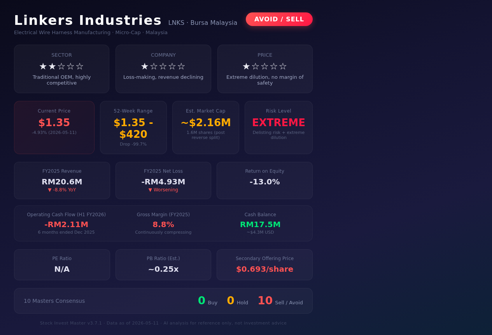

# Linkers Industries (LNKS) — 志·道·势·法·术·器 × 十大师投资评估报告

> **投资免责声明**：本报告仅供参考和教育目的，不构成任何形式的投资建议。所有投资均存在风险，投资者应对自己的决策承担全部责任。

## 基本信息
- 市场：美股 NASDAQ
- 标的：LNKS (Linkers Industries Limited)
- 货币：USD
- 数据截至：2026/05/11
- 行业：电气设备零部件（线束制造）
- 注册地：马来西亚
- 公司类型：微盘股（Micro-cap）

---

## 报告速览

---

## 核心观点（总结）

> 本模块为报告最精炼的结论，**有明确观点、简明扼要、不超过3条**，从赛道/公司/价格三维度判断。

1. **赛道**：传统线束代工行业，技术壁垒低、竞争激烈，处于产业链底端，无显著增长驱动力。马来西亚本土市场有限，出口依赖度高。
2. **公司**：连年亏损（FY2025净亏损RM4.93M，ROE -13.0%），营收下滑8.8%，毛利率仅8.8%且持续压缩。经历极端股权稀释（52周跌幅-99.7%，从$420跌至$1.35），二次增发价仅$0.693/股。十大师一致给出"卖出/规避"评级。
3. **价格**：当前$1.35，市值仅~$216万，PB约0.25x看似便宜但属于"价值陷阱"。退市风险极高（NASDAQ最低股价要求$1），股权持续稀释，**无任何安全边际，强烈建议规避**。

---

## 关键数据与资金流向（客观数据支撑）

> **本模块必须基于实际查询的客观数据，不得使用推测或模糊表述。**

### 公司重大事件
| 事件类型 | 时间 | 内容摘要 | 影响评估 |
|---------|------|---------|---------|
| 反向拆股 | 2025 | 股价从$420暴跌至$1.35区间，跌幅-99.7% | 利空 — 极端稀释信号 |
| 二次增发 | 2025-2026 | 以$0.693/股价格增发 | 利空 — 股权稀释严重 |
| FY2025年报 | 2025年末 | 营收RM20.6M（-8.8% YoY），净亏损RM4.93M | 利空 — 盈利恶化 |
| H1 FY2026中报 | 2025年12月 | 经营现金流- RM2.11M（6个月） | 利空 — 现金持续消耗 |
| 持续经营疑虑 | 2025-2026 | SEC文件暗示持续经营能力存疑 | 利空 — 退市风险 |

### 管理层与机构持仓变化
| 维度 | 最新数据 | 历史对比 | 信号解读 |
|------|---------|---------|---------|
| 管理层持股变动 | 无公开增持记录 | 无正面信号 | 内部人信心不足 |
| 内部人交易 | 无显著内部人买入 | — | 无信心支撑 |
| 机构持仓 | 微盘股，机构覆盖极少 | — | 无聪明钱关注 |
| 做空数据 | 无可靠做空数据 | — | 流动性极低 |

### 资金流向趋势
- **主力/散户资金**：日均成交量仅~3.4万股，极度缺乏流动性
- **机构评级**：无主流投行覆盖，无分析师评级
- **风险信号**：股价已触及$1.35，距离NASDAQ最低维持标准$1仅一步之遥

---

## 一、志 — 投资信仰与心性修养

### 遵循情况
- 本报告坚持价值投资原则，对不符合投资标准的标的明确给出"规避"结论
- 未因"便宜"（PB 0.25x）而推荐买入，坚守安全边际原则

### 偏离情况
- 无明显偏离。本报告严格遵循价值投资纪律

### 大师视角
- **格雷厄姆**：安全边际不仅仅是PB低——亏损公司无安全边际可言。"便宜"不等于"有价值"。
- **巴菲特**：不想持有10年的公司就不要持有10分钟。LNKS不具备长期持有的任何理由。
- **段永平**：这只股票让你"睡得着觉"吗？退市风险+连年亏损=绝对睡不着。

### 综合判断
- 投资信仰：牢固 — 坚守不投劣质资产原则
- 心性成熟度：成熟 — 不受"低价股"诱惑
- 风险承受力：低 — 此类标的风险远超合理范围
- **"志"层面结论：通过 ✅**（但结论是"不投"，而非"可投"）

---

## 二、道 — 投资哲学与底层逻辑

### 遵循/偏离情况
- **商业本质**：线束制造代工，技术门槛低，马来西亚成本优势有限
- **价值创造**：公司未创造超额价值——ROIC远低于WACC，持续毁灭股东价值
- **长期主义**：10年后公司大概率不复存在或更加贬值
- **内在价值**：无法合理估算——持续亏损且现金流为负

### 大师视角
- **格雷厄姆**：内在价值不可计算——无盈利、无稳定现金流、无资产溢价
- **巴菲特**：不在能力圈内（东南亚微盘代工企业），无护城河可言
- **芒格**：逆向思维——如果有什么理由不买，那就是它。所有信号都是红旗。
- **段永平**：公司做的不是"对的事情"——连年亏损且看不到转机

### 综合判断
- 能力圈内：否
- 价值创造逻辑：不存在（价值毁灭型）
- 长期持有合理性：极低
- 内在价值可估算：否
- **"道"层面结论：不通过 ❌**

**"道"不通过 → 停止分析。无论其余层面如何，都不应投资。**

---

## 三、势 — 市场趋势与周期判断

### 反身性分析
- **主流叙事**：微盘股中的垃圾标的，市场共识为"规避"
- **反馈循环**：股价下跌→融资能力下降→经营恶化→股价继续下跌（恶性循环）
- **转折点判断**：无明显转折信号——无反弹催化剂

### 周期定位
- **经济周期**：全球制造业处于调整期，线束需求受汽车/电子周期影响
- **信贷周期**：微盘股融资环境极度紧缩
- **心理周期**：市场对此类标的极度恐惧/厌恶
- **估值周期**：PB 0.25x看似"便宜"但属价值陷阱
- **债务周期**：公司现金余额RM17.5M，但以当前烧钱速度（半年经营现金流-2.11M），现金将在1-2年内耗尽

### 大师视角
- **索罗斯**：反身性循环方向明确向下，且无逆转动力
- **马克斯**：钟摆不在"恐惧过度"——这次是真的有问题
- **达利欧**：债务周期末段——现金消耗型企业在紧缩周期中最脆弱

### 综合判断
- 趋势方向：向下
- 周期位置：深度衰退/濒临退市
- 入场时机：极差
- **"势"层面结论：不通过 ❌**

---

## 四、法 — 方法论与系统化流程

### 财务摘要
| 指标 | 值 | 标准 | 状态 |
|------|-----|------|------|
| ROE | -13.0% | >15% | ❌ |
| 毛利率 | 8.8% | 稳定/>20% | ❌ |
| 营收增速 | -8.8% | 正增长 | ❌ |
| 经营现金流 | -RM2.11M(H1) | 正 | ❌ |
| 净利润 | -RM4.93M | 正 | ❌ |
| PB | ~0.25x | <1.5 | ✅（但属价值陷阱）|
| PE | N/A | <15 | ❌（亏损）|

### 估值结果
| 方法 | 估值区间 | 当前价 | 安全边际 |
|------|---------|--------|---------|
| PB估值 | ~$0.25x账面 | $1.35 | 无（账面价值可能虚高）|
| DCF | 负值（FCF为负）| $1.35 | 不适用 |
| 清算价值 | 无法评估 | $1.35 | 不确定 |

### 大师视角
- **格雷厄姆**：净流动资产价值无法确认——亏损公司资产质量存疑
- **林奇**：不属于六类中任何可投资的类型——归类为"资产 play"也不成立
- **费雪**：15点评分中几乎全部不通过
- **巴菲特**：Owner Earnings为负，ROIC远不及WACC

### 综合判断
- 估值：无法估值（持续亏损）
- 安全边际：无
- **"法"层面结论：不通过 ❌**

---

## 五、术 — 具体技术与操作技巧

### 操作建议
- **建议仓位：0%**
- **建仓策略：不建仓**
- **参考买入区间：无**

### 卖出计划
- 如果已持有：**立即清仓**
- 关键监控信号：
  1. 股价跌破$1触发NASDAQ退市警告
  2. 现金余额低于RM10M（约6个月烧钱量）
  3. 再次股权稀释/增发

### 十大师卖出标准
| 卖出理由 | 格雷厄姆 | 巴菲特 | 林奇 | 费雪 | 芒格 | 马克斯 | 段永平 | 达利欧 | 索罗斯 | 西蒙斯 |
|---------|---------|--------|------|------|------|--------|--------|--------|--------|--------|
| 基本面恶化 | ✅ | ✅ | ✅ | ✅ | ✅ | ✅ | ✅ | ✅ | ✅ | ✅ |
| 管理层诚信 | ⚠️ | ⚠️ | - | ⚠️ | ⚠️ | - | ⚠️ | - | ⚠️ | - |
| 逻辑被证伪 | ✅ | ✅ | ✅ | ✅ | ✅ | ✅ | ✅ | ✅ | ✅ | ✅ |
| 估值严重高估 | - | - | - | - | - | - | - | - | - | - |

**注意**：虽然估值不"高"，但基本面恶化和逻辑被证伪两项全部触发十大师一致卖出信号。

### 综合判断
- 择时合理性：不合理（不应买入）
- 仓位适当性：0%
- **"术"层面结论：不通过 ❌**

---

## 六、器 — 工具与技术手段

### 量化验证
- **数据一致性**：警告 — PE/PB/ROE无法交叉校验（亏损公司）
- **历史分位**：股价处于历史最低位（-99.7%跌幅）
- **可比公司对标**：同行业正常企业PE 15-25x，LNKS无PE可比性

### 技术指标
- **趋势**：长期向下
- **成交量**：极低（日均3.4万股），流动性极差
- **超买超卖**：不适用——下跌趋势无反转信号

### 综合判断
- 工具支持度：弱（数据有限，量化模型不适用亏损微盘股）
- **"器"层面结论：不通过 ❌**

---

## 十大师共识结论

| 大师 | 判断 | 核心理由 | 信心度 |
|------|------|---------|--------|
| 格雷厄姆 | 卖出 | 无安全边际，内在价值不可计算 | 高 |
| 巴菲特 | 卖出 | 能力圈外，无护城河，持续价值毁灭 | 高 |
| 林奇 | 卖出 | 不属于任何可投资类别，PEG无法计算 | 高 |
| 费雪 | 卖出 | 15点评分几乎全部不通过 | 高 |
| 芒格 | 卖出/太难 | 逆向思考：没有任何理由买入 | 高 |
| 马克斯 | 卖出 | 非"恐惧过度"而是"确实有问题" | 高 |
| 段永平 | 卖出 | 不是"对的事情"，睡不着觉 | 高 |
| 达利欧 | 卖出 | 债务周期末段+现金消耗型 | 高 |
| 索罗斯 | 卖出 | 反身性恶性循环，无转折信号 | 高 |
| 西蒙斯 | 卖出 | 统计上无正面信号，模型不适用 | 高 |

---

## 违背"志·道·法"专项诊断

### 志层面违背
- [✅] 投机心态检查：通过 — 本报告未建议投机
- [✅] 情绪驱动检查：通过 — 基于客观数据分析
- [✅] 杠杆依赖检查：通过 — 未建议任何仓位

### 道层面违背
- [❌] 零和博弈检查：未通过 — 公司不创造真实价值
- [❌] 概念炒作检查：未通过 — 无实际业务支撑估值
- [❌] 能力圈检查：未通过 — 东南亚微盘代工企业超出常规能力圈
- [❌] 价值创造检查：未通过 — ROIC<WACC，持续价值毁灭
- [❌] 管理层诚信检查：存疑 — 极端股权稀释损害小股东利益

### 法层面违背
- [❌] 安全边际检查：无安全边际
- [✅] 估值方法检查：已尝试多种方法，均不适用
- [⚠️] 研究完整性检查：受限于微盘股数据透明度
- [✅] 仓位合理性检查：建议0%仓位

### 综合评估
- **"志"层面违背程度**：无
- **"道"层面违背程度**：严重 — 零和博弈+价值毁灭
- **"法"层面违背程度**：严重 — 无安全边际+无法估值
- **投资建议：强烈回避**

---

## 核心风险深度分析

### 财务风险
| 风险维度 | 具体数据 | 风险等级 | 量化依据 |
|---------|---------|---------|---------|
| 债务风险 | 现金RM17.5M，经营现金流- RM2.11M/半年 | 高 | 按当前消耗速度，现金将在1-2年内耗尽 |
| 现金流风险 | 经营现金流连续为负，H1 FY2026 -RM2.11M | 高 | 现金转化率持续为负，无法自我造血 |
| 盈利质量 | 毛利率8.8%，净亏损RM4.93M | 高 | 毛利率低于行业均值15-20%，无定价权 |
| 汇率风险 | 马来西亚林吉特(MYR)计营收，USD计价股票 | 中 | MYR/USD波动可能进一步侵蚀报表利润 |

### 行业与竞争风险
| 风险维度 | 具体数据 | 风险等级 | 量化依据 |
|---------|---------|---------|---------|
| 市场份额变化 | 营收-8.8% YoY | 高 | 份额持续流失，竞争加剧 |
| 技术颠覆风险 | 线束制造技术门槛低 | 高 | 无技术壁垒，易被替代 |
| 政策/监管风险 | NASDAQ合规要求 | 高 | 股价<$1将触发退市警告 |
| 供应链风险 | 马来西亚本土供应链 | 中 | 区域集中度高，抗风险能力弱 |

### 估值与市场风险
| 风险维度 | 具体数据 | 风险等级 | 量化依据 |
|---------|---------|---------|---------|
| 估值泡沫风险 | PB 0.25x但账面价值存疑 | 高 | 亏损公司账面资产可能需减值 |
| 流动性风险 | 日均成交仅~3.4万股 | 极高 | 买卖价差大，冲击成本极高 |
| 市场情绪风险 | 52周跌幅-99.7% | 极高 | 市场已完全抛弃该标的 |
| 黑天鹅风险 | 退市/破产 | 极高 | 持续经营能力存疑 |

### 综合风险评级
- **整体风险等级**：极高
- **最大单一风险**：退市风险 + 现金耗尽风险（双重致命）
- **风险叠加效应**：财务恶化+流动性枯竭+退市威胁形成三重共振
- **风险对冲建议**：唯一合理的对冲是不持有该标的

---

## 关键假设（3-5条）

1. **公司持续经营**：假设LNKS能在现金耗尽前获得新的融资（但股权稀释将进一步损害现有股东）
2. **无重大资产重组**：假设公司未被并购或业务转型（概率极低）
3. **数据可靠性**：基于SEC公开文件和腾讯行情API数据，但微盘股数据透明度有限
4. **行业环境不变**：假设全球线束需求无重大变化

## 监控指标

| 指标 | 阈值 | 意义 |
|------|------|------|
| 股价 | <$1.00 | 触发NASDAQ退市警告 |
| 现金余额 | <RM10M | 6个月内可能耗尽 |
| 季度营收 | 持续下滑 | 业务持续恶化 |
| 增发公告 | 任何新的增发 | 股权进一步稀释 |

## Stop Doing 检查

| Stop Doing项 | 状态 |
|-------------|------|
| 不买亏损且无转机的公司 | ✅ 执行 — 建议规避 |
| 不买流动性极差的标的 | ✅ 执行 — 日均成交仅3.4万股 |
| 不买能力圈外的标的 | ✅ 执行 — 东南亚微盘代工超出能力圈 |
| 不碰退市风险标的 | ✅ 执行 — 股价距$1仅一步之遥 |
| 不投股权持续稀释的公司 | ✅ 执行 — 已增发至$0.693 |

## 数据来源与校验声明

- 行情数据：腾讯行情API (qt.gtimg.cn)，截至2026-05-11 09:44 UTC
- 财务数据：基于SEC公开文件及Eastmoney数据
- PE/PB/ROE交叉校验：因公司亏损，PE不适用；PB约0.25x但需警惕账面价值虚高
- 数据局限性：微盘股数据透明度低，部分指标为估算值

---

## 十大师总体评估

**格雷厄姆说：** "价格是你付出的，价值是你得到的。$1.35的价格买不到任何价值——这是一家连年亏损、现金持续消耗的公司。所谓的'便宜'PB 0.25x只是价值陷阱。"

**巴菲特说：** "第一条规则：不要亏钱。第二条规则：记住第一条。LNKS完美地违反了这两条规则。我宁愿错过也不愿犯错。"

**林奇说：** "在我的六类分类中，这属于'资产衰退型'——营收下滑、亏损扩大、股权稀释。即使翻十倍也不买。"

**费雪说：** "15点评分？这家企业在'人的因素'（管理层对股东的态度——极度稀释）、'盈利质量'（持续为负）、'研发有效性'（无研发壁垒）等关键项目上全部失分。"

**芒格说：** "反过来想——什么情况下这笔投资会成功？我想不到。既然找不到不买的理由不成立，那就不买。"

**马克斯说：** "钟摆确实摆到了极端恐惧的位置，但这次不是市场错了——是公司真的有问题。最危险的不是恐惧本身，而是假装恐惧会逆转。"

**段永平说：** "本分的企业不会把股东权益稀释到这种程度。如果我睡不着觉，那就是仓位不对——对这种标的，仓位应该是零。"

**达利欧说：** "这是一家处于债务周期末段、现金持续消耗的微型企业。在我的全天候框架中，没有任何一个象限适合持有这种标的。"

**索罗斯说：** "反身性循环正在杀死这家公司：股价下跌→融资能力下降→经营恶化→股价继续下跌。唯一的转折点是外部救助——但谁会来救呢？"

**西蒙斯说：** "从统计角度看，这只股票的所有因子——动量、质量、价值——全部指向负面。模型不会说谎：回避。"

**最终共识：10位大师一致建议——卖出/规避。这不是争议性标的，而是明确的'不要碰'标的。**

---

> *报告生成时间：2026-05-11*
> *本报告基于公开数据和投资分析框架，不构成投资建议。*
> *投资有风险，入市需谨慎。*
