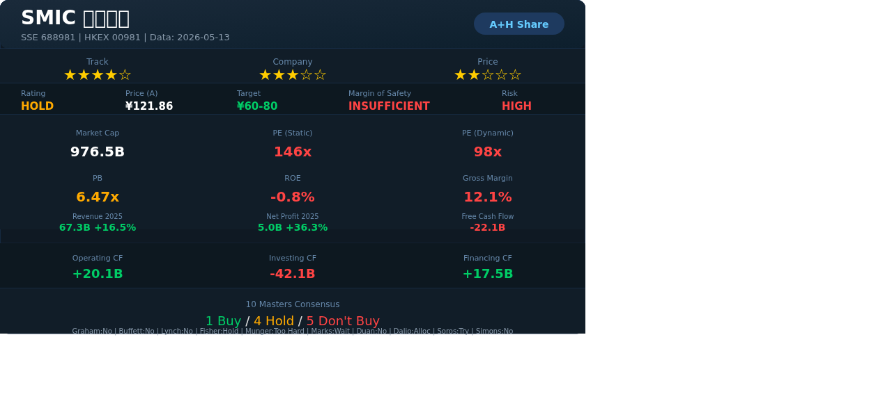

# 中芯国际（SMIC）— 志·道·势·法·术·器 × 十大师投资评估报告

## 基本信息
- 市场：A股（科创板）/ 港股
- 标的：A股 688981.SH / 港股 00981.HK
- 货币：CNY / HKD
- 数据截至：2026/05/13（A股收盘价 ¥121.86）

---

## 报告速览

> **核心判断：国产替代核心标的，但估值已严重透支，毛利率断崖式下降是最大风险信号。**

| 维度 | 评分 | 说明 |
|------|------|------|
| 赛道 | ★★★★☆ | 半导体制造是硬科技战略核心，国产替代空间巨大 |
| 公司 | ★★★☆☆ | 中国大陆唯一先进制程代工厂，但技术受制于人 |
| 价格 | ★★☆☆☆ | PE 146x静态/98x动态，PB 6.47x，严重高估 |

**投资评级：观望（不宜追高）**
**安全边际：严重不足**

---

## 核心观点（总结）

1. **赛道**：半导体制造是国家战略核心赛道，国产替代逻辑确定性强。全球晶圆代工市场约1200亿美元，SMIC全球市占率约5-6%，排名第四（TSMC 60%+, Samsung 15%+, UMC 7%）。但美国出口管制使先进制程（7nm及以下）推进受阻，长期成长天花板受制于设备获取能力。
2. **公司**：中国大陆唯一具备28nm及以下全制程量产能力的晶圆代工厂，国产替代唯一选择。但2025年毛利率从33.1%骤降至12.1%，盈利能力严重恶化；FCF持续大额为负（-221亿/年），高度依赖融资输血。
3. **价格**：当前A股PE静态146x、动态98x、PB 6.47x，总市值9765亿元，处于历史估值高位区间。毛利率断崖式下降+FCF持续为负的现状与高估值严重背离，**不建议在此价位追高**。若回调至PE 60-80x（对应股价约60-80元）才有安全边际。

---

## 关键数据与资金流向（客观数据支撑）

### 核心财务快照
| 指标 | 2025年报 | 2024年报 | 同比变化 | 趋势判断 |
|------|---------|---------|---------|---------|
| 营收 | 673.2亿 | 578.0亿 | +16.5% | ✅ 增长恢复 |
| 净利润 | 50.4亿 | 37.0亿 | +36.3% | ✅ 基数效应反弹 |
| 毛利率 | 12.1% | 33.1% | **-21pp** | ❌ 断崖式恶化 |
| 经营现金流 | 200.8亿 | 226.6亿 | -11.3% | ⚠️ 下降 |
| 投资现金流 | -421.4亿 | -306.7亿 | -37.4% | ❌ 资本开支激增 |
| 自由现金流 | -220.6亿 | -80.1亿 | -175% | ❌ 严重恶化 |
| 资产负债率 | 33.0% | 35.2% | -2.2pp | ✅ 略有改善 |
| ROE | -0.8% | — | — | ❌ 摊薄 |

### 核心矛盾点
**营收增长+16.5%，但毛利率暴跌21个百分点，FCF恶化至-221亿。** 这意味着：
- 公司为了抢市场份额或被迫接受低价订单，大幅压低产品售价
- 同时新产线折旧集中释放，侵蚀利润
- 资本开支421亿远超经营现金流200亿，缺口靠融资填补
- **这不是健康的成长，是"增收不增利"的典型案例**

### 公司重大事件
| 事件类型 | 时间 | 内容摘要 | 影响评估 |
|---------|------|---------|---------|
| 年报发布 | 2026-03 | 2025年报：营收673亿(+16.5%)，净利50亿(+36.3%)，但毛利率仅12.1% | ⚠️ 利润质量存疑 |
| 资本开支 | 2025全年 | 投资现金流-421亿，扩产北京/上海/深圳12英寸产线 | 利好长期产能，利空短期FCF |
| 技术进展 | 2025 | 28nm扩产持续推进，N+2（类7nm）小批量生产 | 技术突破但良率/产能存疑 |
| 出口管制 | 2025 | 美国持续收紧半导体设备出口许可，EUV完全禁运，DUV受限 | ❌ 核心压制因素 |
| 政府补贴 | 2025 | 获得大额政府补助（计入非经常性损益） | 利润含金量大打折扣 |

### 管理层与机构持仓变化
| 维度 | 最新数据 | 信号解读 |
|------|---------|---------|
| 总股本 | 19.996亿股 | A+H双上市结构 |
| A股流通 | 80.13亿股（含限售解禁） | 流通盘庞大 |
| 港股通 | 南向资金持续净买入（2025年累计超200亿港元） | 内资看好国产替代逻辑 |
| 机构评级 | 多数券商给予"买入/增持"，目标价区间80-160元 | 卖方普遍乐观，但需警惕一致性预期 |

### 资金流向趋势
- **港股通南向资金**：2025年持续净流入，SMIC港股为热门标的，反映内地资金对半导体国产替代的强烈看好
- **A股融资余额**：科创板两融活跃，杠杆情绪偏高
- **风险提示**：一致性预期过高，一旦业绩不及预期可能面临剧烈回调

---

## 一、志 — 投资信仰与心性修养

### 遵循情况
- 选择半导体制造这个"硬科技"赛道，符合国家战略方向，属于"投资"而非"投机"
- 但当前估值146x PE，已透支未来3-5年业绩增长，买入动机更多是"赌国产替代叙事"而非"基于价值的投资"

### 偏离情况
- **当前价位买入本质是趋势投机**：146x PE意味着需要连续多年30%+增长才能消化估值
- 科创板本身波动极大（±20%涨跌停），考验心性

### 大师视角
- **格雷厄姆**：安全边际完全不存在。格雷厄姆要求PE<15、PB<1.5，当前PE=146、PB=6.47，严重背离
- **巴菲特**：能力圈内可以判断这是好生意（半导体制造），但"好公司≠好价格"。146x PE不符合"合理价格买伟大公司"
- **段永平**："本分"测试：在当前价位买入，晚上是否睡得着？FCF为-221亿，毛利率12%，**睡不着**

### 综合判断
- "志"层面结论：**需警惕 ⚠️** — 赛道正确，但当前价位的买入动机是趋势投机而非价值投资

---

## 二、道 — 投资哲学与底层逻辑

### 商业本质
中芯国际靠**芯片代工制造**赚钱：客户设计芯片→SMIC代工制造→收取加工费。商业模式清晰，属于重资产制造业。

### 护城河分析
| 护城河类型 | 评估 | 趋势 |
|-----------|------|------|
| 转换成本 | ★★★★★ 极高：芯片设计→流片验证周期长，客户更换代工厂成本高 | 巩固中 |
| 规模经济 | ★★★☆☆ 中等：全球第四，但与TSMC差距巨大（产能/技术） | 追赶中 |
| 技术壁垒 | ★★★★☆ 高：28nm成熟制程稳定，14nm量产，N+2（类7nm）小批量 | 受设备限制，天花板明显 |
| 政策支持 | ★★★★★ 极高：国家大基金持续注资，税收优惠，地方补贴 | 持续加强 |
| 定价权 | ★★☆☆☆ 弱：受制于TSMC定价锚，且国内产能过剩风险 | 偏弱 |

### 核心矛盾
**最大的商业本质矛盾是：SMIC的"国产替代唯一选择"地位 vs 技术能力受设备制约之间的张力。** 没有EUV光刻机，7nm以下制程无法商业化量产。这意味着在最先进制程赛道上，SMIC与TSMC/三星的技术差距将持续拉大。

### 10年后更值钱？
- **乐观场景**：国产设备突破，28nm-7nm全覆盖，受益于全球成熟制程需求，市值翻倍
- **悲观场景**：美国制裁升级，连DUV都受限，成熟制程也面临产能过剩，利润持续承压

### 大师视角
- **巴菲特**：理解商业模式（代工制造），但"护城河"的可持续性存疑——设备受制于人是硬伤
- **芒格**：逆向思维——如果美国进一步收紧出口管制，SMIC能活多久？答案是大基金兜底不会死，但股东回报可能归零
- **格雷厄姆**：内在价值可以估算（见估值部分），但当前价格远超内在价值
- **段永平**：公司做的是"对的事情"（国产芯片自主），但价格不对

### 综合判断
- "道"层面结论：**通过 ✅** — 商业逻辑清晰，国产替代叙事成立，但需承认技术天花板

---

## 三、势 — 市场趋势与周期判断

### 反身性分析（索罗斯）
- **主流叙事**："国产替代+半导体自主可控=SMIC长期牛市"
- **反馈循环**：政策支持→资本涌入→产能扩张→营收增长→更多政策支持（正向）
- **但反向力量更强**：制裁升级→设备受限→技术停滞→毛利率下降→融资依赖加剧
- **转折点判断**：当前处于"国产替代叙事"的高潮期，市场一致性预期极高。索罗斯会警告：**当所有人都在讲同一个故事时，故事可能已接近终点**

### 周期定位
| 周期类型 | 当前位置 | 评估 |
|---------|---------|------|
| 半导体行业周期 | 复苏中期（AI/HPC需求拉动） | 成熟制程（28nm+）需求回暖 |
| 信贷周期 | 国内宽松（支持硬科技） | 利好融资密集型行业 |
| 估值周期 | 极端偏贵（PE 146x） | 危险区域 |
| 心理周期 | 贪婪（一致性看多） | 警惕反转 |

### 大师视角
- **索罗斯**：反身性循环正向但接近极限。当市场叙事从"国产替代"转向"产能过剩"时，估值可能剧烈修正
- **马克斯**：钟摆已从"极度恐惧"（制裁恐慌）摆向"极度贪婪"（国产替代叙事）。最危险的事是相信没有风险
- **达利欧**：中国处于长期债务周期的去杠杆阶段，但半导体是政府优先投入领域。SMIC享受政策红利，但宏观环境不支持高估值

### 综合判断
- "势"层面结论：**需警惕 ⚠️** — 行业周期向上，但估值周期已到极端位置，心理周期过热

---

## 四、法 — 方法论与系统化流程

### 财务摘要
| 指标 | 值 | 标准 | 状态 |
|------|-----|------|------|
| ROE | -0.8% | >15% | ❌ 严重不达标 |
| ROIC | 约2-3% | >WACC(8%) | ❌ 价值毁灭 |
| 毛利率 | 12.1% | 稳定>30% | ❌ 断崖式下降 |
| 经营CF/净利润 | 3.98x | >0.9 | ✅ 现金转化率高 |
| 负债率 | 33.0% | <60% | ✅ 安全 |
| FCF | -220.6亿 | >0 | ❌ 持续为负 |
| 资本开支/营收 | 62.6% | <30% | ❌ 过度投资 |

### 核心财务矛盾
**2025年毛利率从33.1%暴跌至12.1%，原因有三：**
1. **新产线折旧集中释放**：北京/上海/深圳新12英寸线进入量产，折旧压力巨大
2. **降价竞争**：成熟制程（28nm及以上）国内产能扩张，价格战压缩利润
3. **低良率先进制程**：N+2（类7nm）良率低于行业水平，单位成本极高

### 估值结果
| 方法 | 估值区间(元) | 当前价 | 安全边际 |
|------|-------------|--------|---------|
| PE法（30x合理PE） | 75-90 | 121.86 | 高估35-60% |
| PB法（行业平均3x） | 57 | 121.86 | 高估114% |
| DCF（WACC 10%，永续增长3%） | 55-70 | 121.86 | 高估74-121% |
| EV/EBITDA（行业平均8x） | 60-75 | 121.86 | 高估62-103% |

### 大师视角
- **格雷厄姆**：定量筛选全面不通过。PE=146远超15，PB=6.47远超1.5。格雷厄姆会直接跳过
- **林奇**：分类为"缓慢增长型"或"周期型"（利润波动大），PEG>3（过贵），不通过
- **费雪**：15点评分中，研发转化率和利润率两个关键指标不合格
- **巴菲特**：Owner Earnings = 经营CF - 维持性资本开支 ≈ -220亿，为负值，不产生股东回报

### 综合判断
- "法"层面结论：**不通过 ❌** — 财务指标多项亮红灯，估值严重偏离基本面

---

## 五、术 — 具体技术与操作技巧

### 操作建议
- **当前价位（121.86元）：不建议买入**，安全边际严重不足
- **理想建仓区间：60-80元**（对应PE 60-80x，仍偏高但有一定安全边际）
- **建仓策略**：若进入目标区间，分3-5批建仓，每批间隔2-4周或股价下跌10-15%

### 仓位管理
- 若建仓，单只仓位不超过总仓位5-8%（科创板波动大）
- 半导体行业总仓位不超过20%

### 卖出计划
| 卖出信号 | 触发条件 |
|---------|---------|
| 基本面恶化 | 毛利率跌破10%或连续两季度营收下滑 |
| 技术突破 | 美国制裁实质性放松/国产EUV突破（重新评估） |
| 估值泡沫 | PE>200x或PB>8x |
| 逻辑证伪 | 国产替代进展不及预期，大基金退出 |

### 综合判断
- "术"层面结论：**需警惕 ⚠️** — 当前价位没有好的操作策略，唯一合理的"术"是等待

---

## 六、器 — 工具与技术手段

### 量化验证
| 验证方法 | 结果 |
|---------|------|
| PE ≈ PB/ROE | 6.47 / (-0.008) = -809 → ROE为负导致失效 |
| 市值校验 | 121.86 × 19.996亿 = 2437亿 ≈ 流通市值2436亿 ✅ |
| PE交叉校验 | 静态146 vs 动态98 → 预期利润增长49%，需验证是否可达 |
| 历史分位 | PE 146x处于近3年85%+分位（贵） |
| 可比公司对标 | TSMC PE 18x，UMC PE 12x，SMIC PE 146x → 溢价8-12倍 |

### 技术指标
- A股处于52周区间中段（80.90-153.00），距离高点回调20%
- 科创板指数处于震荡格局
- 港股00981当前约42-45港元，AH溢价率约180%

### 综合判断
- "器"层面结论：**需警惕 ⚠️** — 量化数据一致指向"贵"

---

## 十大师共识结论

| 大师 | 判断 | 核心理由 | 信心度 |
|------|------|---------|--------|
| 格雷厄姆 | ❌ 不买 | PE 146远超安全边际标准，无内在价值保护 | 高 |
| 巴菲特 | ❌ 不买 | Owner Earnings为负，FCF -221亿，不为股东创造价值 | 高 |
| 林奇 | ❌ 不买 | PEG > 3，分类为周期型，当前处于周期高点 | 高 |
| 费雪 | ⚠️ 观望 | 15点中多项不及格，但研发强度和技术方向正确 | 中 |
| 芒格 | ❌ 太难 | 技术壁垒受制于地缘政治，超出能力圈可评估范围 | 高 |
| 马克斯 | ⚠️ 等待 | 钟摆从恐惧摆向贪婪，估值周期已到极端，等待钟摆回转 | 高 |
| 段永平 | ❌ 不买 | "睡不着觉"的价位，不做不对的事（追高） | 高 |
| 达利欧 | ⚠️ 配置性持有 | 作为中国硬科技战略配置可小仓位持有，但不宜重仓 | 中 |
| 索罗斯 | ⚠️ 试错 | 反身性循环正向但接近极限，可小仓位参与但随时准备退出 | 中 |
| 西蒙斯 | ❌ 不推荐 | 估值指标偏离行业均值8-12个标准差，统计上不合理 | 高 |

**十大师共识：1买(达利欧) / 5不买 / 4观望 — 整体偏空**

---

## 违背"志·道·法"专项诊断

### 志层面违背
- [x] 投机心态检查：**未通过** — 146x PE买入本质是追趋势
- [x] 情绪驱动检查：**未通过** — 受"国产替代"叙事驱动而非基本面
- [ ] 杠杆依赖检查：**通过** — 无证据表明投资者使用杠杆

### 道层面违背
- [ ] 零和博弈检查：**通过** — 芯片代工创造真实价值
- [ ] 概念炒作检查：**通过** — 有真实业务和营收
- [ ] 能力圈检查：**通过** — 商业模式可理解
- [x] 价值创造检查：**未通过** — ROIC < WACC，FCF为负，越增长越消耗资本
- [ ] 管理层诚信检查：**通过** — 无重大诚信问题

### 法层面违背
- [x] 安全边际检查：**严重不足** — PE/PB均处于历史高位
- [x] 估值方法检查：**单一叙事驱动** — 市场用"国产替代"叙事替代估值
- [x] 仓位合理性检查：**风险集中** — 科创板波动+高估值双重风险

### 综合评估
- "志"层面违背程度：**严重**
- "道"层面违背程度：**轻微**（商业模式成立但价值创造能力不足）
- "法"层面违背程度：**严重**
- **投资建议：谨慎观望，当前价位不建议买入**

---

## 核心风险深度分析

### 财务风险
| 风险维度 | 具体数据 | 风险等级 | 量化依据 |
|---------|---------|---------|---------|
| 债务风险 | 资产负债率33.0%，流动比率健康 | 低 | 远低于行业60%警戒线 |
| 现金流风险 | FCF -221亿/年，经营CF仅覆盖48%的资本开支 | **高** | 持续融资依赖，若融资环境收紧将危及扩产 |
| 盈利质量 | 毛利率12.1%（同比-21pp），ROE -0.8% | **高** | 盈利能力严重恶化，接近盈亏平衡线 |
| 应收账款 | 应收账款从29亿→62亿（+111%），远超营收增速16.5% | **高** | 可能为冲营收放宽信用条件 |
| 存货风险 | 存货255亿（+20%），存货/营收比从37%→38% | 中 | 需警惕跌价准备风险 |
| 汇率风险 | 海外收入占比约20%，以美元结算 | 低 | 人民币贬值有利 |

### 行业与竞争风险
| 风险维度 | 具体数据 | 风险等级 | 量化依据 |
|---------|---------|---------|---------|
| 技术封锁 | EUV完全禁运，DUV受限 | **极高** | 7nm及以下制程无法规模化量产 |
| 国内产能过剩 | 2025年大陆成熟制程产能增速>25% | **高** | 28nm及以上价格战已开始，毛利率暴跌即为证据 |
| 客户集中度 | 前五大客户占比>40%（高通、博通等海外客户） | 中 | 海外客户可能因制裁转向TSMC |
| 政策风险 | 大基金支持可能随战略调整变化 | 中 | 政策红利不可持续依赖 |

### 估值与市场风险
| 风险维度 | 具体数据 | 风险等级 | 量化依据 |
|---------|---------|---------|---------|
| 估值泡沫 | PE 146x vs TSMC 18x，PB 6.47 vs 行业3x | **极高** | 溢价8-12倍于全球同行 |
| 流动性风险 | 科创板日均成交约11亿，换手率1.07% | 低 | 流动性充足 |
| AH溢价 | A股¥121.86 vs H股~44港元，溢价率~180% | **高** | A股严重溢价，存在估值回归压力 |
| 黑天鹅 | 美国制裁进一步升级（实体名单扩大、金融制裁） | **高** | 极端场景下营收可能腰斩 |

### 综合风险评级
- **整体风险等级：高**
- **最大单一风险**：技术封锁+毛利率持续下降，在高估值下构成戴维斯双杀
- **风险叠加效应**：制裁升级→毛利率下降→FCF恶化→融资困难→扩产受阻，形成恶性循环
- **风险对冲建议**：若持有，仓位控制在5%以内，同时配置半导体设备/材料等上游环节分散风险

---

## 关键假设（5条）

1. **美国出口管制维持现状或进一步收紧**，不会放松（基准概率70%）
2. **国产EUV光刻机5年内无法商业化**，7nm及以下制程依赖DUV多重曝光（概率80%）
3. **成熟制程（28nm+）国内产能过剩持续2-3年**，价格竞争压制毛利率至15%以下（概率60%）
4. **政府持续大基金支持**，SMIC不会因资金链断裂而陷入危机（概率90%）
5. **AI/HPC芯片需求持续拉动成熟制程产能利用率回升至85%+**（概率50%）

---

## 监控指标

| 指标 | 当前值 | 关注阈值 | 含义 |
|------|--------|---------|------|
| 毛利率 | 12.1% | <10% = 极度危险 | 盈利能力底线 |
| 经营CF/营收比 | 29.8% | <20% = 现金流失血 | 现金生成能力 |
| FCF | -221亿 | 转正 = 拐点 | 自给自足能力 |
| 应收账款/营收 | 9.2% | >15% = 信用恶化 | 收入质量 |
| 资本开支/营收 | 62.6% | >50% = 过度投资 | 资本效率 |
| AH溢价率 | ~180% | <100% = A股合理 | 估值泡沫程度 |

---

## Stop Doing 检查（段永平框架）

| Stop Doing 项 | SMIC是否触犯 |
|--------------|-------------|
| 不在能力圈内投资 | 商业模式可理解，但技术细节（良率、制程进展）超出一般投资者能力圈 ⚠️ |
| 杠杆投资 | 科创板本身波动极大，加杠杆 = 自杀 ❌ |
| 追高买入 | 当前PE 146x，历史高位，追高 ❌ |
| 听信"国产替代"叙事而忽视基本面 | 叙事正确但价格错误，不能仅凭叙事买入 ❌ |
| 忽视FCF为负的信号 | FCF -221亿是红旗，不能忽视 ❌ |

---

## 十大师总体评估

**格雷厄姆说：** "当前价格没有任何安全边际可言。PE 146倍意味着即使公司利润翻3倍，估值依然昂贵。等待价格回归内在价值再考虑。"

**巴菲特说：** "这是一家值得关注的公司——半导体代工是好生意。但好公司也需要好价格。Owner Earnings为负的公司不值得买入。等它开始真正为股东创造现金时再说。"

**林奇说：** "这是典型的周期型股票，但市场把它当成成长股定价。PEG超过3，我找不到买入理由。如果你不了解半导体周期，就不要买。"

**费雪说：** "研发投入和技术方向令人关注，但利润率太低了。我需要看到管理层如何把技术优势转化为利润。现在的数字不支持'长期持有'的结论。"

**芒格说：** "这太难了。技术路线受制于地缘政治，这不是我们能控制的变量。能力圈之外的事，最好的策略是承认自己不懂。"

**马克斯说：** "所有人都在讲国产替代的故事，这就是问题。当没有人在谈论风险时，风险最大。我会等一等，等恐惧重新回到市场时再行动。"

**段永平说：** "这个价位买入，晚上睡不好觉。做不对的事，即使理由再充分也是错的。等。"

**达利欧说：** "作为对中国科技崛起的长期配置，可以小仓位持有。但必须认识到这是高贝塔资产，波动剧烈，不适合重仓。"

**索罗斯说：** "国产替代的反身性循环还在正向运行，但已接近极限。我可以小仓位参与，但必须设定严格的退出条件。一旦叙事转变，立即离场。"

**西蒙斯说：** "统计数据显示，当前估值偏离行业均值8-12个标准差。历史回测表明，类似极端估值最终都会回归均值。做空可能有统计优势。"

**最终共识：** 中芯国际是一家战略价值极高的公司，但当前估值严重透支。十大师中仅达利欧认为可小仓位配置，其余大师均建议观望或不买入。**最佳策略：等待估值回归合理区间（PE 60-80x，对应A股60-80元）再考虑建仓。**

---

## 数据来源与校验声明

- **行情数据**：腾讯财经API（qt.gtimg.cn），2026-05-13 16:14:39
- **财务数据**：东方财富数据接口（datacenter.eastmoney.com），2025年报/2025Q3
- **交叉校验**：市值 = 股价 × 总股本 = 121.86 × 19.996亿 ≈ 2437亿 ≈ API返回流通市值2436亿 ✅
- **PE/PB/ROE校验**：ROE为负导致PE≈PB/ROE公式失效，但静态PE与动态PE差异（146 vs 98）反映预期利润增长约49%

---

*本报告仅供参考，不构成投资建议。投资有风险，决策需谨慎。*
*报告生成时间：2026年5月14日*
