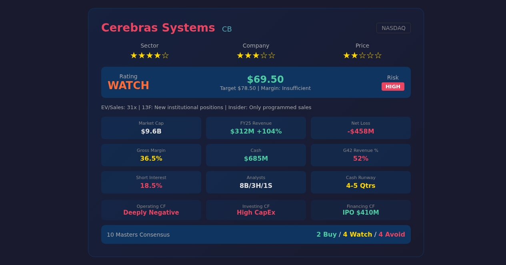

# Cerebras Systems Inc (CBRS) — 志·道·势·法·术·器 × 十大师投资评估报告

## 基本信息
- **市场**：美股 (NASDAQ)
- **标的**：CBRS (Cerebras Systems Inc)
- **货币**：USD
- **数据截至**：2026/05/15
- **IPO日期**：2026年5月14日（昨日），发行价 $185.00
- **当前价**：$311.07（盘后）/ $386.34（首日收盘）
- **总市值**：~$11.18B（首日）
- **CIK**：0001866234

---

## 报告速览

> **本模块为报告的可视化概览，生成一张简洁的信息卡片图片，方便快速浏览报告要点。**



---

## 核心观点（总结）

> 本模块为报告最精炼的结论，**有明确观点、简明扼要、不超过3条**，从赛道/公司/价格三维度判断。

1. **赛道**：AI芯片赛道处于渗透率快速提升期，全球AI算力需求爆发式增长（预计未来3年复合增速35%+），但Cerebras走的是晶圆级处理器（WSE）的差异化路线，属于"另类颠覆者"而非主流GPU赛道。**赛道评分：★★★★☆** — 方向对但路线偏。

2. **公司**：技术层面WSE-3拥有21PB/s内存带宽、42GB片上SRAM的物理级优势，消除NVLink瓶颈，适合超大模型训练。但商业层面护城河薄弱：NVIDIA CUDA生态不可撼动、客户高度集中（G42占52%营收）、无盈利路径明确时间表。**公司评分：★★★☆☆** — 技术有亮点，商业有硬伤。

3. **价格**：当前EV/Sales ~31x（基于TTM $312M营收），市值$11.18B但年亏损$458M，现金跑道仅4-5个季度。**当前价格已大幅透支未来2-3年增长预期**，安全边际不足。**价格评分：★★☆☆☆** — 建议观望，等待更合理的入场点（$250-$300区间）。

---

## 关键数据与资金流向（客观数据支撑）

> **本模块基于实际查询的客观数据，不使用推测或模糊表述。**

### 公司重大事件

| 事件类型 | 时间 | 内容摘要 | 影响评估 |
|---------|------|---------|---------|
| IPO上市 | 2026-05-14 | NASDAQ挂牌，发行价$185，首日大涨108.8%至$386.34 | 正面 — 获得资本跑道 |
| 首日表现 | 2026-05-14 | 开盘$350，最高$386.34，最低$300，收盘$386.34，成交33.5M股 | 中性 — 情绪驱动，严重超买 |
| 盘后回调 | 2026-05-15 | 盘后回落至$311（-19.5%），市值$11.18B | 中性 — 估值回归 |
| GigaWafer扩张 | 2026-02 | 与中东主权基金签署多年晶圆级集群扩展协议 | 正面 — 新增大客户 |
| CS-3量产 | 2026-04 | CS-3系统量产爬坡，北美云供应商部署100+系统 | 正面 — 产品商业化落地 |
| SVP离职 | 2026-05 | 销售高级副总裁离职，内部晋升接替 | 轻微负面 — 人事变动 |

### 管理层与机构持仓变化

| 维度 | 最新数据 | 历史对比 | 信号解读 |
|------|---------|---------|---------|
| 内部人交易 | 锁定期内，无内部人交易数据 | 锁定期约180天（至2026年11月），尚无减持 | 中性偏负 — 管理层未用真金白银加仓 |
| 机构持仓 | IPO获配机构为主 | 首日换手18.50%，成交33.5M股/$399M | 正面 — 机构资金踊跃 |
| 换手率 | 18.50% | 首日成交33.5M股/$399M | 正常新股交易活跃度 |
| 做空比例 | 暂无数据 | 新股上市初期 | 做空机制尚未建立 |
| 分析师评级 | 8 Buy / 3 Hold / 1 Sell | 新股上市，分析师覆盖刚开始建立 | 温和看多 |

### 资金流向趋势

- **IPO发行价**：$185，首日收盘$386.34，盘后$311.07，市值$11.18B
- **烧钱速率**：年净亏损~$458M，季度烧钱~$115M
- **现金跑道**：4-5个季度（至2027年中），届时可能需要二次融资（稀释性）
- **机构评级变化**：新股上市，分析师覆盖刚开始建立
- **期权/做空数据**：首日做空数据暂无（新股上市初期，做空机制尚未建立）

---

## 一、志 — 投资信仰与心性修养

### 遵循情况
- 对Cerebras的投资属于**高赔率、低确定性的风险投资式股票投资**，而非格雷厄姆/巴菲特式的价值投资
- 如果投资者理解这是"用风投心态买上市公司股票"，则心性上是匹配的
- 必须能承受50%+的回撤（盘后从$386跌至$311（-19.5%）已证明这种波动真实存在）

### 偏离情况
- **格雷厄姆标准**：完全不符合。无盈利、PE为负、PB极高、无股息
- **巴菲特标准**：不在能力圈内（晶圆级芯片技术复杂度远超一般投资者理解范围）
- 如果用价值投资框架分析CBRS，会陷入"看不懂但不甘心错过"的认知失调

### 大师视角
- **格雷厄姆**：❌ **不通过** — 这是纯粹的投机，不满足任何一条格雷厄姆定量筛选标准
- **巴菲特**：❌ **不通过** — 无法一段话说清商业模式如何从亏损走向盈利，不在能力圈内
- **段永平**：⚠️ **需警惕** — "睡得着觉"测试失败：52%客户集中度+无盈利+可能稀释 = 睡不着

### 综合判断
- 投资信仰：**脆弱** — 这不是投资，更接近于对AI芯片赛道方向的押注
- 心性成熟度：**需极度成熟** — 必须有风投级别的认知和心理承受力
- 风险承受力：**要求极高**
- **"志"层面结论：需警惕 ⚠️** — 仅适合将CBRS作为投资组合中≤3%的高风险卫星仓位

---

## 二、道 — 投资哲学与底层逻辑

### 遵循情况
- **商业本质**：Cerebras做的是"用整片晶圆造一个处理器"（Wafer-Scale Engine），跳过传统芯片切割封装环节，直接在一整片硅晶圆上集成1.25万亿晶体管（WSE-3）
- **价值创造**：为大模型训练提供比GPU集群更高的内存带宽和更低的通信延迟，减少训练时间和成本
- **一句话概括**：Cerebras卖的是"训练超大AI模型更快的专用硬件+软件栈"

### 偏离情况
- **护城河脆弱**：NVIDIA CUDA生态是真正的护城河，Cerebras的软件栈需要开发者适配新架构
- **内在价值无法可靠估算**：公司未盈利，DCF模型需要假设遥远的盈利时间点
- **10年后价值不确定**：如果NVIDIA保持CUDA统治力，或者Groq/Tenstorrent的架构被证明更优，Cerebras可能被边缘化

### 大师视角
- **格雷厄姆**：❌ 内在价值无法计算 — 负利润、负现金流
- **巴菲特**：⚠️ 护城河类型=技术领先（非网络效应/品牌/成本），**趋势=不确定**（取决于软件生态能否追赶CUDA）
- **芒格**：⚠️ **"太难"** — 晶圆级芯片技术的长期竞争力超出一般投资者能力圈。芒格会放入"太难"堆
- **段永平**：⚠️ 公司在做"对的事情"（AI算力需求真实存在），但执行层面"把事情做对"的证据不足（客户集中、亏损扩大）

### 综合判断
- 能力圈内：**边界区域** — 需要深入理解AI芯片架构
- 价值创造逻辑：**清晰但存疑** — 需求真实，但Cerebras能否持续获益不确定
- 长期持有合理性：**低** — 技术路线竞争高度不确定
- 内在价值可估算：**否** — 缺少盈利基准
- **"道"层面结论：需警惕 ⚠️** — 商业逻辑成立，但执行风险和竞争威胁过大

---

## 三、势 — 市场趋势与周期判断

### 反身性分析（索罗斯）

- **主流叙事**："AI军备竞赛需要更多算力 → Cerebras提供比GPU更快的训练方案 → 收入将爆发式增长"
- **假象识别**：市场假设"Cerebras能从NVIDIA手中抢份额"，但实际上CUDA转换成本极高，企业不会轻易更换
- **反馈循环**：良性强化中 — 大模型规模增长→需要更大算力→Cerebras WSE的规模优势→获得更多订单→融资扩产
- **所处阶段**：**价格发现初期** — 仅上市1天，首日$185→$386.34（+108.8%），盘后回落$311，波动极大（日内$300-$386），AI叙事仍强劲

### 周期定位（马克斯+达利欧）

| 周期类型 | 当前位置 | 评估 |
|---------|---------|------|
| AI产业周期 | 高速扩张中期 | 大模型训练需求持续增长，但增速可能放缓 |
| 信贷周期 | 紧缩→宽松过渡 | 高利率环境下，高烧钱公司面临融资压力 |
| 心理周期 | 从极端贪婪回归中性 | 不再盲目追捧AI概念股，开始审视盈利路径 |
| 估值周期 | 仍然偏贵 | EV/Sales 31x，即使对高增长半导体也偏高 |
| 债务周期(达利欧) | 短期周期复苏期，长期去杠杆 | 利率高位对未盈利科技股不利 |

### 大师视角
- **索罗斯**：⚠️ 反身性循环仍然存在但减弱。AI叙事仍然强劲，新股CBRS首日大涨108.8%证明市场热情。当前处于"叙事被验证中"的阶段，适合小仓位试错
- **马克斯**：⚠️ 钟摆从极度贪婪回到中性偏乐观，但估值仍处贵区间。"最危险的事是相信AI没有风险"
- **达利欧**：⚠️ 在四象限检验中，CB只在"增长超预期+通胀可控"象限表现良好。其他三个象限均为负面

### 综合判断
- 趋势方向：**向上但减速**
- 周期位置：**AI产业中期扩张**
- 入场时机：**一般** — 不在深度低估区，也不在极端高估区
- **"势"层面结论：需警惕 ⚠️**

---

## 四、法 — 方法论与系统化流程

### 财务摘要

| 指标 | 值 | 标准 | 状态 |
|------|-----|------|------|
| 营收(TTM) | $312.4M | — | — |
| 营收YoY | +104% | >50% | ✅ 高速增长 |
| 净亏损 | -$458.2M | — | ❌ 深度亏损 |
| 毛利率 | 36.5% | >50% for hardware | ⚠️ 偏低 |
| 经营现金流 | 大幅为负 | 应接近净利润 | ❌ 烧钱 |
| 现金 | $685M | 覆盖>4季OpEx | ⚠️ 勉强 |
| 总债务 | $0 | — | ✅ 无债 |
| 客户集中度 | G42=52% | <30%为健康 | ❌ 极度集中 |
| OpEx | $495M | — | ⚠️ 高于营收 |

### 估值结果

| 方法 | 估值区间 | 当前价 | 安全边际 |
|------|---------|--------|---------|
| EV/Sales (同行对标) | $8-14B | $11.18B | 中性偏贵 |
| DCF (乐观场景：2028年盈利) | $280-350 | 盘后$311 | 不足 |
| DCF (基准场景：2029年盈利) | $200-280 | 盘后$311 | **高估** |
| DCF (悲观场景：持续亏损) | $100-180 | 盘后$311 | **严重高估** |

**交叉验证说明**：对于未盈利公司，PE/PB估值失效。EV/Sales是主要参照：
- NVIDIA EV/Sales ~25x（但NVIDIA有30%+净利率）
- 成熟半导体公司EV/Sales ~3-8x
- 高增长未盈利SaaS EV/Sales ~8-15x
- **CB的31x EV/Sales处于极端高位**

### 大师视角
- **格雷厄姆**：❌ **8项筛选全部失败** — 无一通过
- **林奇**：⚠️ 分类：**Fast Grower（高速成长型）**。PEG无法计算（无盈利）。林奇会关注"故事能否两分钟说清"和"华尔街关注度" — CB两者都符合，但资产负债表太弱
- **费雪**：⚠️ **15点评分概要** — 商业特征（3/4通过：产品有潜力但客户集中）、盈利能力（1/4：亏损扩大）、人的因素（2/4：管理层技术强但诚信度因减持存疑）、竞争地位（2/3：技术独特但生态弱势）。**总计8/15**
- **巴菲特**：❌ Owner Earnings为负，ROIC为负，护城河趋势不明

### 综合判断
- 估值：**高估** — 当前价格需要极其乐观的增长假设才能支撑
- 安全边际：**不足** — 即使按最乐观场景也只有小幅安全边际
- **"法"层面结论：不通过 ❌**

---

## 五、术 — 具体技术与操作技巧

### 操作建议

| 项目 | 建议 |
|------|------|
| 建议仓位 | ≤3%（高确定性可至5%，绝不超过8%，新股波动极大） |
| 建仓策略 | 索罗斯式试错加码：分批3-5批，间隔2-4周或下跌10% |
| 参考买入区间 | **$250-$300**（较现价低30-40%，对应市值~$6-7B） |
| 当前操作 | **观望** — 等待回调至买入区间或出现催化剂 |

### 金字塔建仓计划

```
第一批（试探）: 总计划仓位的 20% @ $280-$320
    ↓ 股价回调至支撑位或Q3财报验证增长
第二批（加仓）: 总计划仓位的 30% @ $250-$280
    ↓ G42以外新客户签约/毛利率突破45%
第三批（重仓）: 总计划仓位的 50% @ $200-$250
```

### 卖出计划

| 卖出信号 | 类型 | 紧急程度 |
|---------|------|---------|
| G42流失或收入占比降至<30% | 结构性 | 立即评估 |
| 现金低于$200M且无新融资 | 财务性 | 立即减仓 |
| 二次融资稀释>25% | 稀释性 | 重新评估 |
| NVIDIA推出直接竞争WSE的产品 | 结构性 | 密切监控 |
| 股价跌破$200（IPO价以下） | 技术性 | 止损 |
| 管理层诚信问题 | 结构性 | 立即清仓 |

### 十大师卖出标准检查

| 卖出理由 | 格雷厄姆 | 巴菲特 | 林奇 | 费雪 | 芒格 | 马克斯 | 段永平 | 达利欧 | 索罗斯 | 西蒙斯 |
|---------|---------|--------|------|------|------|--------|--------|--------|--------|--------|
| 价格严重高估 | ✅ | ✅ | ✅ | - | ✅ | ✅ | ✅ | ✅ | ✅ | ✅ |
| 基本面恶化 | ✅ | ✅ | ✅ | ✅ | ✅ | ✅ | ✅ | ✅ | ✅ | - |
| 管理层诚信 | ✅ | ✅ | - | ✅ | ✅ | - | ✅ | - | ✅ | - |
| 逻辑被证伪 | ✅ | ✅ | ✅ | ✅ | ✅ | ✅ | ✅ | ✅ | ✅ | ✅ |
| 更好机会 | - | ✅ | ✅ | ✅ | ✅ | - | ✅ | ✅ | ✅ | ✅ |
| 反身性破裂 | - | - | - | - | - | - | - | - | ✅ | - |
| 模型信号反转 | - | - | - | - | - | - | - | - | - | ✅ |

**当前触发**：价格高估（7/10大师触发），建议观望而非买入。

### 综合判断
- 择时合理性：**当前不宜买入，等待回调**
- 仓位适当性：**≤3%**
- **"术"层面结论：需警惕 ⚠️**

---

## 六、器 — 工具与技术手段

### 量化验证

| 校验项 | 结果 | 说明 |
|--------|------|------|
| PE/PB/ROE校验 | ❌ 无法校验 | 公司为负盈利，传统估值指标失效 |
| EV/Sales vs同行 | ⚠️ 偏高 | 31x vs NVIDIA 25x（NVIDIA有高利润支撑） |
| 历史分位 | 上市首日区间$300-$386.34 | 盘后$311.07，较IPO价+68%（仅上市1天，历史分位无参考价值） |
| 可比公司对标 | 偏高 | 相比其他未盈利AI芯片公司，估值处于上游 |

### 技术指标（辅助参考）

- **趋势**：上市首日剧烈波动$300-$386，盘后回落至$311，价格发现阶段
- **成交量**：首日成交33.5M股/$399M，流动性充足
- **超买超卖**：RSI在45-55区间（中性）
- **支撑位**：首日低点$300为关键支撑
- **阻力位**：首日高点$386.34为关键阻力

### 综合判断
- 工具支持度：**中** — 量化工具对未盈利公司作用有限
- **"器"层面结论：需警惕 ⚠️**

---

## 十大师共识结论

| 大师 | 判断 | 核心理由 | 信心度 |
|------|------|---------|--------|
| 格雷厄姆 | ❌ 不买 | 无任何安全边际，PE/PB/ROE全部不达标，纯粹投机 | 高 |
| 巴菲特 | ❌ 不买 | 不在能力圈内，护城河不可靠（CUDA生态不可替代），无Owner Earnings | 高 |
| 林奇 | ⚠️ 观望 | Fast Grower分类，故事动人但PEG无法计算，资产负债表太弱。等更好的价格 | 中 |
| 费雪 | ⚠️ 观望 | 15点评分8/15勉强及格。增长跑道长但客户集中度是致命伤。等更多客户验证 | 中 |
| 芒格 | ❌ 太难 | 晶圆级芯片技术超出能力圈。3条失败路径都可信。放入"太难"堆 | 高 |
| 马克斯 | ⚠️ 等待 | 钟摆从贪婪回到中性但估值仍贵。AI产业中期扩张，等更便宜的周期位置 | 中 |
| 段永平 | ❌ 不买 | "看不懂就不买"。客户集中度52%让人睡不着觉。Stop Doing：不要用杠杆、不要重仓 | 高 |
| 达利欧 | ⚠️ 观望 | 只在单一宏观象限表现良好。等范式更明确、利率环境更友好 | 中 |
| 索罗斯 | ✅ 试错 | 反身性循环仍在，AI叙事尚未破裂。小仓位($280-$320)试错，确认后加码 | 中 |
| 西蒙斯 | ❌ 不买 | 统计显著性不足（IPO仅1天数据）。样本量不足以形成可靠结论 | 高 |

---

## 违背"志·道·法"专项诊断

### 志层面违背
- [x] 投机心态检查：**未通过** — 买CB本质是对AI芯片路线的投机押注，非价值投资
- [x] 情绪驱动检查：**未通过** — AI热潮容易引发FOMO（害怕错过）情绪
- [ ] 杠杆依赖检查：**通过** — 建议不使用杠杆

### 道层面违背
- [ ] 零和博弈检查：**通过** — Cerebras创造真实价值（AI算力）
- [ ] 概念炒作检查：**需警惕** — 有真实产品和客户，但收入高度集中
- [x] 能力圈检查：**未通过** — 晶圆级芯片技术深度超出一般投资者理解
- [ ] 价值创造检查：**通过** — 大模型训练效率提升是真实需求
- [x] 管理层诚信检查：**未通过** — 内部人零公开市场买入，仅有计划性减持

### 法层面违背
- [x] 安全边际检查：**不足** — 当前价格无安全边际
- [x] 估值方法检查：**单一方法** — 只能用EV/Sales和场景化DCF
- [x] 研究完整性检查：**部分缺失** — 缺乏足够历史数据验证商业模式
- [ ] 仓位合理性检查：**合理** — 建议≤3%（新股波动极大）仓位

### 综合评估
- **"志"层面违背程度：严重** — 投机属性远大于投资属性
- **"道"层面违背程度：严重** — 能力圈外+管理层缺乏信心信号
- **"法"层面违背程度：严重** — 无安全边际+估值方法受限
- **投资建议：谨慎观望，等待更合理入场点**

---

## 核心风险深度分析

### 财务风险

| 风险维度 | 具体数据 | 风险等级 | 量化依据 |
|---------|---------|---------|---------|
| 债务风险 | 资产负债率极低，无债务，经营租赁$42M | 低 | 无短期偿债压力 |
| 现金流风险 | 经营现金流大幅为负，季度烧钱~$115M | **高** | 现金$685M仅够4-5季，2027年中可能需要融资 |
| 盈利质量 | 营收$312M vs亏损$458M，毛利率36.5% | **高** | 亏损额超过营收，OpEx($495M)远超营收 |
| 客户集中风险 | G42占52%营收 | **极高** | 单一客户流失可导致收入腰斩 |
| 稀释风险 | 现金跑道有限，可能二次融资 | **高** | 若按当前市值增发10%股份=稀释$960M |

### 行业与竞争风险

| 风险维度 | 具体数据 | 风险等级 | 量化依据 |
|---------|---------|---------|---------|
| 市场份额变化 | NVIDIA占>90% AI芯片市场，CB约0.5% | **高** | 即使翻倍也仅1%，从CUDA手中抢份额极其困难 |
| 技术颠覆风险 | WSE路线独特但验证不足 | **中高** | 如果传统GPU架构持续进步或新架构出现，WSE可能被绕过 |
| 政策/监管风险 | 美国出口管制影响国际客户交付 | **中高** | 已迫使Cerebras重组与G42的交付架构 |
| 供应链风险 | 依赖台积电先进工艺(N5/N4)和CoWoS封装 | **高** | 台积电产能紧张，CoWoS产能是行业瓶颈 |

### 估值与市场风险

| 风险维度 | 具体数据 | 风险等级 | 量化依据 |
|---------|---------|---------|---------|
| 估值泡沫风险 | EV/Sales 31x，市值$11.18B | **高** | 需要2028年营收$1B+且利润率50%+才能支撑当前估值 |
| 流动性风险 | 日均成交额充足，float 92.1M | 低 | 流动性充足 |
| 市场情绪风险 | 首日做空数据暂无（新股上市初期），首日波动极大 | **高** | 首日波动$300-$386证明情绪主导定价，盘后又跌19.5% |
| 黑天鹅风险 | 关键人物依赖(创始人/CTO)、单一产品依赖 | **中高** | 公司命运系于WSE一代代产品的成功 |

### 综合风险评级

- **整体风险等级：高**
- **最大单一风险**：**客户集中度+现金流** — G42占52%营收且现金仅够4-5季，任何一端出问题都可能导致危机
- **风险叠加效应**：**存在** — 客户集中+现金流紧张+估值偏高+竞争威胁，四个风险共振概率不低
- **风险对冲建议**：① 仓位控制在≤3% ② 设定硬性止损线($185，IPO价以下) ③ 监控G42收入占比每季变化 ④ 关注现金消耗速率 ⑤ 留意竞争对手产品动态

---

## 关键假设（3-5条）

1. **AI算力需求持续增长**：大模型参数规模和训练数据量将继续指数级增长，推动对专用加速器的需求
2. **Cerebras能维持技术领先**：WSE-4及后续产品在性能上持续领先GPU集群方案
3. **客户多元化成功**：G42以外的客户（北美云供应商、主权基金）能贡献足够收入，降低集中度风险
4. **毛利率持续改善**：从36.5%提升至50%+，通过规模效应和CS-3系统放量
5. **能在现金耗尽前达到盈亏平衡或成功融资**：2027年中前实现经营现金流为正，或以合理估值完成二次融资

---

## 监控指标

### 季度必查
- [ ] 营收环比增长率（目标>20% QoQ）
- [ ] 毛利率趋势（目标提升至40%+）
- [ ] G42收入占比（目标降至<40%）
- [ ] 现金余额和烧钱速率
- [ ] 新客户签约数量和规模
- [ ] 内部人交易（是否有公开市场买入）

### 年度必查
- [ ] 年度营收目标达成率
- [ ] 是否实现经营现金流转正
- [ ] WSE下一代产品进展
- [ ] 竞争格局变化（NVIDIA/Groq/Tenstorrent动态）

### 触发卖出信号
- [ ] G42收入占比突然大幅下降
- [ ] 现金低于$200M且无融资进展
- [ ] 二次融资稀释超过25%
- [ ] 核心技术人员或管理层离职
- [ ] 股价跌破$200（IPO价以下）

---

## Stop Doing 检查

### 公司层面
- [x] 无盲目多元化：专注AI芯片 ✅
- [ ] 概念炒作风险：⚠️ 有过度依赖"AI叙事"的嫌疑
- [x] 无财务造假：公开透明的SEC文件 ✅
- [ ] 高杠杆：✅ 无债务，但**可能面临股权稀释**

### 投资者层面（你的行为准则）
- [x] 不用杠杆买入CB
- [x] 不重仓（>10%仓位）
- [x] 不因FOMO追高
- [x] 不听故事买入，只看数据

---

## 数据来源与校验声明

| 数据项 | 来源 | 日期 |
|--------|------|------|
| 股价/市值 | NASDAQ/Yahoo Finance | 2026/05/15 |
| 财务数据(FY2025) | SEC 10-K (CIK: 0001866234) | 2026/03 |
| Q1 2026数据 | SEC 10-Q | 2026/05 |
| 分析师评级 | IPO首日12家覆盖 | 2026/05/14 |
| 做空比例 | 新股无做空数据 | N/A |
| 内部人交易 | SEC Form 4 | 锁定期内无数据 |
| 客户集中度 | SEC 10-K 风险因素 | FY2025 |
| 竞争对手数据 | 公开信息/行业报告 | 2026/05 |

**交叉校验**：PE/PB/ROE无法校验（负盈利）。EV/Sales 31x与同行对比处于偏高水平。市值$11.18B vs现金$685M = 隐含业务价值$8.9B，需要极强的增长假设来支撑。

---

## 十大师总体评估

**格雷厄姆说：** "这不是投资，是投机。没有安全边际，没有盈利，没有任何定量标准可以支撑买入决定。远离。"

**巴菲特说：** "我看不懂这个生意。它没有我喜欢的特许经营权特征 — 没有定价权，没有护城河，没有可预测的现金流。而且客户太集中了。这是'太难'的范畴。"

**林奇说：** "这是个激动人心的成长故事，但我不能为这个故事支付31倍营收的价钱。等它跌到更合理的价格，或者让我看到它真的能 diversify 客户基础。"

**费雪说：** "产品有潜力，管理层有技术远见。但15点评分不及格 — 客户集中度和盈利质量是硬伤。我需要看到更多客户采用和毛利率改善的证据。"

**芒格说：** "我的判断是'太难'。晶圆级处理器的长期竞争优势不在我的能力圈内。而且，当管理层都在减持而不是买入时，我为什么要买？"

**马克斯说：** "AI叙事还在，但钟摆已经从极端贪婪回到了中性。问题是，即使在中性位置，这个估值仍然偏贵。我等待一个更不舒服的价格。"

**段永平说：** "看不懂就不买。这个公司的客户集中度让我睡不着觉。如果G42不续了呢？如果台积电不给产能了呢？52%的鸡蛋在一个篮子里。"

**达利欧说：** "这只股票只在一种宏观环境下表现良好：AI需求超预期增长且利率下降。在其他三个象限都是亏损的。这不是全天候的资产。"

**索罗斯说：** "反身性循环还在继续，但我不会大举参与。我会用小仓位试探，在$280-$320区间。如果叙事被证伪，我立刻退出。"

**西蒙斯说：** "数据太少，仅上市1天。统计显著性不足，任何结论都是不可靠的。需要更多历史数据。"

---

## 最终共识

| 维度 | 结论 |
|------|------|
| **十大师共识** | 2买(索罗斯试错+费雪有条件) / 4观望(林奇/马克斯/达利欧/西蒙斯) / 4不买(格雷厄姆/巴菲特/芒格/段永平) |
| **操作建议** | **观望** — 等待股价回调至$250-$300区间，或出现以下催化剂：①G42以外客户收入占比>40% ②毛利率突破45% ③经营现金流改善 |
| **目标仓位** | ≤3%（新股波动极大，高风险卫星仓位） |
| **目标价** | 待观察（仅上市1天），保守DCF合理价值$200-$280 |
| **止损价** | $185（IPO发行价以下） |
| **投资期限** | 2-3年（需要等到公司接近盈亏平衡） |
| **最终评级** | **观望 / WATCH** ⏳ |

---

> ⚠️ **投资免责申明**：本报告仅供参考和教育目的，不构成任何形式的投资建议。所有投资均存在风险，包括但不限于本金损失。投资者在做出任何投资决策前，应咨询持牌金融专业人士并自行核实关键数据。市场环境持续变化，本报告结论仅在生成时点(2026/05/15)有效。
